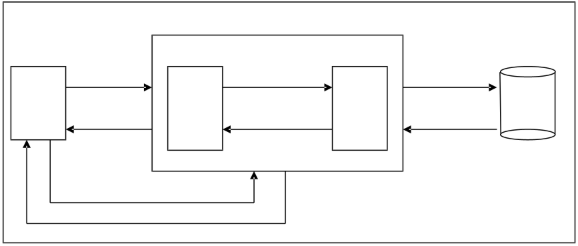
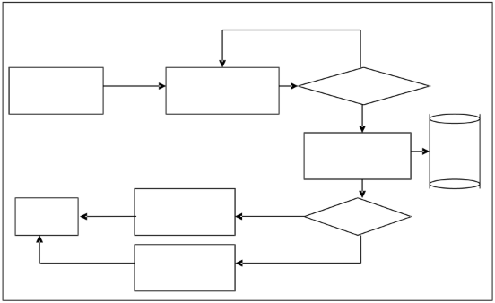
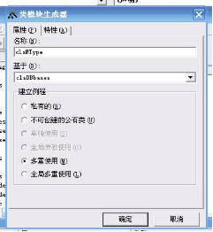

重庆电大毕业论文

论文题目：小 型 超 市 收 银 系 统

学生姓名：

学 号：

专 业：计算机科学与技术 年 级：

指导老师：

完成时间：2008 年 9 月

I

目 录

摘要 ...............................................................................................................................................................IV Abstract......................................................................................................................................................... V 1 绪论 .............................................................................................................................................................1

1. 传统商品经营方式论述 .................................................................................................................1
1. 现代超市经营方式概述 .................................................................................................................1
1. 两种经营方式的比较 .....................................................................................................................1

2 系统分析 .....................................................................................................................................................1

1. 问题的提出 .....................................................................................................................................1
1. 可行性分析 .....................................................................................................................................2
1. 经济可行性分析 .................................................................................................................2
1. 技术可行性分析 .................................................................................................................2
3. 系统开发环境简介 .........................................................................................................................3

3 系统设计思想 .............................................................................................................................................3

1. 多层 C/S 架构的设计 .....................................................................................................................3
1. 面向对象设计 .................................................................................................................................4
1. 使用 ADO操纵数据 .........................................................................................................................6
1. 什么是 ADO..........................................................................................................................6
1. 系统功能模块设计 ............................................................................................................ 7
3. 在 Visual Basic 中使用 ADO........................................................................................... 7
3. ADO的一般使用步骤 ......................................................................................................... 8
4. 系统功能划分 .................................................................................................................................9

   3\.4.1 系统模块划分 .....................................................................................................................9

   3\.4.1 系统结构设计 .....................................................................................................................9

4 数据库设计 ...............................................................................................................................................10

1. 数据库需求分析 ...........................................................................................................................10
1. 数据库概念结构设计 ...................................................................................................................11
1. 数据库逻辑结构设计 ...................................................................................................................12

5 开发业务逻辑处理组件 ...........................................................................................................................14

1. 信息管理类加集合类的设计思想 .............................................................................................. 14
1. 组件的通用模块 ...........................................................................................................................15
1. 自定义枚举类 ...........................................................................................................................15
1. 组件的公共模块 .......................................................................................................................16

   3. 创建模板类 .......................................................................................................................18
3. 商品类型信息管理模块 ...............................................................................................................19
1. 商品类型信息管理类 clsMType..................................................................................... 20
1. 商品类型信息管理集合类 clsMTypes ...........................................................................22

6 开发基本界面组件 ...................................................................................................................................23

1. 信息输入界面加操作类的设计思想 .......................................................................................... 23

   6\.1.1 每个模块的组成 ...............................................................................................................23

   6\.1.3 操作类的代码结构 .......................................................................................................... 25

2. 创建组件的公共模块 ...................................................................................................................25
2. 商品类型管理模块 .......................................................................................................................25
1. 商品类型信息输入对话框设计 ...................................................................................... 25
1. 商品类型信息输入对话框代码设计 ..............................................................................26

7 用户界面端应用程序设计 .......................................................................................................................32

1. 公共模块的设计 ...........................................................................................................................32
1. 添加成员变量 ...................................................................................................................32
1. 修改 Main 过程 .................................................................................................................33
2. 用户登录模块的设计 ...................................................................................................................33
1. 用户登录对话框 ...............................................................................................................33
1. 用户登录对话框代码设计 .............................................................................................. 33

8 系统的调试与注意事项 ...........................................................................................................................34

1. 强制变量声明 ...............................................................................................................................34
1. 常见错误的避免 ...........................................................................................................................35
1. 数据类型不匹配 ...............................................................................................................35
1. 数据与数据库限制相冲突 .............................................................................................. 35
1. 变量声明错误 ...................................................................................................................35
1. 资源的建立与释放 .......................................................................................................... 35

结 论 .............................................................................................................................................................36 致 谢 .............................................................................................................................................................36 参考文献 .......................................................................................................................................................36

小型超市收银系统

摘要：社会的进步带动了科学的发展，人们的物质生活水平也随之不断提高，各种各样的小型超 市如同雨后的春笋一般，快速的出现在人们的生活中。在机遇和挑战面前，商家们更加地注重超市

经营管理的投入和产出，如何快速地、有效地管理超市的经营活动，是各位商家必须面对的现实问 题。小型的超市收银系统的出现，切实有效地解决了这个难题。本文依据软件工程的原理，采用面 向对象的设计方法，详细地论述小型超市收银系统的开发过程。论文主要介绍了本课题的开发背景， 所要完成的功能和开发的过程。在系统分析的前提下，本论文重点说明了总体设计，数据库的设计 以及系统详细的设计和实现过程，主要说明了系统设计的重点、设计思想、技术难点和解决方案。

关键词：小型超市； 超市经营；小型超市收银系统； 软件工程； 面向对象

Small supermarket cashier system

LI Lin

(Grade 2005, Computer Science and Technology, Chongqing Radio & TV University , Wanzhou, Chongqing 404000 )

**Abstract**：Social progress led the development of science，People's living standards also will continue to increase, a variety of small supermarkets, as the Bamboo shoots after the rain, rapid appear in people's lives. In the face of opportunities and challenges, businesses are more focused on supermarket management of inputs and outputs, and how quickly, and effective management of the supermarket business is that businesses must face the reality of the problem. Small supermarket cashier system in the emergence of an effective solution to this problem. In this paper, based on the principles of software engineering, object-oriented design methods, detailed discussion of the small supermarket cashier system development process. The main thesis on the subject of development background, to be completed by the function and the development process. Under the premise of the analysis, this paper focuses on the overall design, database design and system of detailed design and implementation process, mainly that the focus of the system design, design ideas, technologies and solutions difficult

**Key words:** Small supermarket； Supermarket operator； Small supermarket cash register system； Software Engineering； Object-oriented

1 绪论![ref1]

1. 传统商品经营方式论述

在过去，商家经营商店的主要经营方式是个人经营为主，采用账簿记账的方式记录经营状况。 在进货时，商家依据个人销售的需要到各个批发商处批发相应的商品，同时在进货账簿中记录下商 品的价格、名称和相应的数量；在销售时，商家根据顾客的消费情况，依次在销售账簿中记录下每 单销售的情况，对小额的消费顾客不开具销售发票，仅对大额消费的顾客开具销售发票。长此以往， 将产生大量的账簿，这不仅给商家在保存账簿方面带来诸多的不便，而且还不利于商家对销售情况 的统计分析，不利于商家对以后销售战略的计划。长此以久，将严重影响商店的未来发展。

2. 现代超市经营方式概述

在现在，各大超市都采取连锁经营的模式，并采用计算机技术辅助经营。连锁超市在进货方面， 有的是由统一的批发商来对超市供货，有的则是由个人联系商品批发商来获得需求的商品。在进货 的过程中，先是用账簿记录进货记录，然后再由专门的工作人员将进货记录输入计算机中，并对商 品进行编号，接着，把商品按类分别放到相应的货架上，并标上价格；在销售时，由经培训过的收 银员用扫描仪扫描商品的条形码，或是手工将商品的编号输入计算机中，计算机查询数据库后，返 回相应得价格，收银员收取相应金额后，便打印出销售小票给顾客。现代的超市收银方式，便利快 捷，且能方便商家分析销售情况，对商家制定销售策略有很大的帮助。但是，现代收银系统需要由 有专业技能的操作员来操作，并且系统庞大，要求有专业人员来维护，另外，系统硬件开销大，这 些种种的开销，对于小型的超市来说是一笔不小的开销，对小型超市的发展带来巨大的负担

3. 两种经营方式的比较

传统的经营方式和现代的经营方式各有各的优点和缺点。以往的经营方式，在经营成本上较低， 一般只需要进货成本，商家一人经营即可，忙时只要增加一到两个临时促销员就可以了。但是，大 量的账簿、账单要整理统计，工作繁琐容易出错；进货、销售都是由商家一人承担，工作的劳动量 大。而现代的经营方式则大大的降低了劳动强度，计算机技术的引入，大大地减少了经营者繁琐的 工作。但是，专用收银机等设备的昂贵价格以及维护费用可是一笔不小的开销。

2 系统分析

1. 问题的提出

   商家若要想将商店成功地转型到小型超市，不仅仅是要在销售场地上扩大，经营品种上增加，

第 37 页 共 37 页

销售人员上增多，最重要的还是要能在管理技术上的提高。由于商家将个人的经营场地扩大，经营 品种增多，所以在经营上就必须增加必要的导购员以帮助顾客购物，保安员以确保超市的安全等等。 工作人员的增多，这对管理员管理员工提出了要求，如何保存和管理员工信息是商家要面对的问题。 另一方面，商家扩大了商店的经营范围，增加了经营商品的品种，因此，商品信息的保存和保密就 又是商家要解决的另一问题，并且这些信息如何在商家销售商品时能快速的获取，如果还是按以往 的方法，光靠脑子记或许已经行不通了，查询账簿效率又太低。面对这些问题，商家们不应该再依 靠以往的管理方式来经营小型超市，应该采用现代的超市管理方式来经营小型超市，但是高额的经 营成本又让大部分商家望而却步。因此，综合传统和现代的超市管理技术的优势，开发小型超市收 银系统便成为了各位商家的迫切需求了。

2. 可行性分析
1. 经济可行性分析

超市收银系统开发需要投资费用和未来的运行维护费用，其中投资费用主要包括系统开发费 用、设备费用、人员费用及其他费用，如由于工作方式改变需要增加的其他开支，通常为了保证新 系统运行的可靠性，要求手工和计算机在长时间并存。然而本系统由本人独立开发，所以系统的开 发成本几乎为零，仅仅需要投资后期的维护费用。系统的收益主要通过新系统提高工作效率，直到 经营策略来实现，还有其他难以计算的指标，比如：

- 货物管理中节省的人力，减轻的劳动强度。
- 降低的成本及其他费用。
- 改进薄弱环节，提高的工作效率。
- 提高数据处理的及时性和准确性。
2. 技术可行性分析

小型超市收银管理系统的硬软件要求都是能够容易达到的，一般个人的 PC机都是可以满足的， 不必购买专用的超市收银设备，具体配置要求如表 2-1 所示，

|硬、软件|配置|
| - | - |
|CPU|PIII 800 以上|
|RAM|64MB|
|硬盘|3G|
|监视器|Windows 系统支持的监视器，可显示 16 位|
|打印机|Windows98，Windows2000，Windows NT Server 支持的各类打印机|
|操作系统|中文 Windows98，Windows2000，Windows NT Server|
|网络协议|TCP/IP|
|网络系统|Windows2000|

表 2-1 系统软硬件配置要求

3. 系统开发环境简介![ref1]

微软公司的 Visual Basic 6.0 是 Windows 应用程序开发工具，它是开发系统最为广泛的、易学 易用的面向对象的开发工具。Visual Basic 提供了大量的控件，这些控件可用于设计界面和实现各 种功能，减少了编程人员的工作量，也简化了界面设计过程，从而有效的提高了应用程序的运行效 率和可靠性。故而，实现本系统 VB 是一个相对较好的选择。

Access 就是关系数据库开发工具，数据库能汇集各种信息以供查询、存储和检索。Access 的 优点在于它能使用数据表示图或自定义窗体收集信息。数据表示图提供了一种类似于 Excel 的电 子表格，可以使数据库一目了然。另外，Access 允许创建自定义报表用于打印或输出数据库中的 信息。Access 也提供了数据存储库，可以使用桌面数据库文件，也可以把数据库文件置于网络文 件服务器，与其他网络用户共享数据库。Access 是一种关系数据库工具，关系数据库是已开发的 最通用的数据库之一。如上所述，Access 作为关系数据库开发具备了许多优点，可以在一个数据 包中同时拥有桌面数据库的便利和关系数据库的强大功能。

3 系统设计思想

1. 多层 C/S 架构的设计

   为了便于日后系统的扩展，本系统采用多层架构设计，可以有两种工作原理，分别如下所示。 图3-1是逻辑上采用多层设计，而在物理结构上，仍采用三层布局的设计方式，即界面+组件+

数据库。

图3-2是逻辑上采用多层设计，而在物理结构上，也采用多层布局的设计方式，即界面+界面组 件+逻辑组件+数据库

在三层结构中，业务层只是封装了必要的业务逻辑和操作数据库相应的对象模型的类，而如果 想用此组件再开发另一个类似系统，仍需设计相关的数据输入和显示界面，在一般情况先，这些基 本界面往往是变化不大的，这就使代码重用性受到一定影响，降低了系统开发的效率，并增加了出 错的可能性。

多层结构是在三层结构基础上进一步发展起来的，本系统在逻辑上就是采用了多层结构的设 计。在本系统中，将原三层结构中位于用户界面层，实现业务逻辑的基本界面，如数据输入与修改 界面等，再次分离出来，形成新的一层——基本界面层，在顶层的用户界面层只要地用户包装这些 基本界面即可。如数据录入、修改界面。当然，这并不妨碍用户界面曾直接调用逻辑组件中的类来 获取数据，因为基本界面层只是缩短开发周期而设计的，并为日后系统向网络系统的发展奠定基础。

用户界面层 基本界面层 业务逻辑层 数据存储层

业务逻辑组件 组织 SQL语句，

发出查看商品 查询数据库

用 户 信息命令 基本 给出商品 ID 业务

操 作 界面 逻辑 数据库

将传回的信息示到 返回查询结果，

界面 完成命令 部分 相应的控件 部分 封装成类

返回客户对象，内部有客户信息 给出商品 ID，要查看商品信息

图3-1 逻辑结构上三层布局的设计方式

用户界面层 基本界面层 业务逻辑层 数据存储层

发出查看商 组织 SQL 语句，

品信息命令 基本 给出商品 ID 业务 查询数据库

用户

界面 逻辑

操作 数据库

组件 将传回的信息显 组件 返回查询结果，

界面 完成命令 示到相应的控件 封装成类

给出商品 ID，要查看商品信息 返回客户对象，内部有客户信息

图 3-2 逻辑结构上多层布局的设计方式

2. 面向对象设计

面向对象(Object Oriented,OO)是当前计算机界关心的重点，它是90年代软件开发方法的主 流。面向对象的概念和应用已超越了程序设计和软件开发，扩展到很宽的范围。如数据库系统、交 互式界面、应用结构、应用平台、分布式系统、网络管理结构、CAD技术、人工智能等领域。

面向对象设计是把分析阶段得到的需求转变成符合成本和质量要求的、抽象的系统实现方案的 过程。从面向对象分析到面向对象设计，是一个逐渐扩充模型的过程。 采用面向对象方法开发软 件的基本目的和主要优点是通过重用提高软件的生产率、提高重用性、提高可扩充性、提高健壮性。 因此，本系统采用基于面向对象的设计思想来开发。

图3-3时添加一种商品的数据流程：通过商品操作对象调入添加商品窗口，此窗口接收用户输入 后，再调用商品信息对象将数据存储到数据库中。

用户界面层 基本界面层 业务处理层 数据存储层![ref1]

返回重填

否

同时传入显示商

品的列表控件

在 clsOpMerch.Add 函数

发调出用添cls加M商er品ch.命Ad令d 中弹出 frmMerch 对话框 用户输入正确

是

调用 clsMerch.AddNew

将数据写到数据库 数据库

在 clsOpMerch.Add函 是

命令完成

数中更新控件 写入成功

否

在 clsOpMerch.Add函

数中给出错误提示

图3-3 添加商品的数据流图 图3-4是显示商品列表的数据流图，与添加商品不同的是，现实商品信息的窗口不是由商品操

作对象调用的，而是由用户界面层传入一个列表框的引用。在商品操作对象中，首先调用商品信息 对象从数据库中获取信息，然后将所得信息添加到此列表框控件中，从而实现商品信息的显示。

用户界面层 同时传入显示商 基本界面层 业务处理层 数据存储层

品的列表控件

调用 clsOpMerch 类 调用 clsMerchs 类的 组织 SQL 语句查找数

的 FillListView 方法 Find 方法查找商品 据库，将结果存到

clsMerchs 对象中返回 数据库

逐个取出 clsMerchs 中的 命令完成 clsMerch 对象，添加到列表

框中

图3-4 显示商品列表的数据流图

用户界面层 用户界面层 业务处理层 数据存储层

调用 clsOpMerch.Delect 传入商品列表 是 组织 SQL 语句

发出删除商品命令 删除？ 更新数据库

数据库

否

是 在clsOpMerch.Delect

完成命令 中更新控件 写入成功

否

在clsOpMerch.Delect

中给出错误信息

图3-5 删除商品信息数据流图

用户界面层 基本界面层 业务处理层 数据存储层

返回重填 否

传入商品列表

调用 clsMerch.Modify 在 clsOpMerch.Modify

发 出 修 改 商 品 信 息 命 函 数 中 弹 出 frmMerch 输入正确

令 对话框

是

数据库

组织 SQL 语句

更新数据库

命令完成 在 clsOpMerch.Modify 是

函数中更新控件 写入成功

否

在 clsOpMerch.Modify

函数中给出错误信息

图3-6 修改商品信息数据流图 以上数据流图基本体现了本系统面向对象的设计思路。在本系统中不仅将各个数据模型封装成

类的形式，而且也将对这些数据的操作封装成类，从而将系统的设计理念上升到更高的一层，增强 了代码重用性和减少了各个模块之间的偶合性。

3. 使用 ADO操纵数据

ADO（ActiveXData Objects）是 Microsoft 提供并建议在 Visual Studio6.0 环境中使用的数 据库访问的接口。借助它，应用程序可以轻松地操纵诸如 Access、SQL Server 和 Oracle 等数。

1. 什么是 ADO

ADO，即Active Data Objects，实际上是一种提供访问数据类型的连接机制。ADO被实现为OLEDB 之上的一个薄层，这使得ADO可以有更快的访问速度，更易使用，同时更节省资源。ADO被设计成一 种非常简单的格式，通过ODBC的方法同数据库接口相连。用户可以使用任何一种ODBC数据源，不仅 适合于SQL Server、Oracle、Access等数据库的应用程序，也适合于Excel表格、文本文件、图形 文件和无格式的数据文件。

ADO使用OLEDB数据库支持提供了一个面向对象的访问数据源的接口，它是DAO和RDO对象模型的 基大成者，集合了DAO和RDO的优点。

ADO的另一大优点是，它是基于 COM接口技术的 OLEDB的高级接口，所以，任何支持 COM的应 用程序都可以实现 ADO。也就是说，ADO的应用范围绝不仅仅是 VB，甚至于不仅仅是 Visual Studio 家族的产品。

2. ADO的内置类![ref1]

ADO提供了一系列的类和方法，用来与数据库建立连接，然后对数据库中的数据进行各种操作。 下面介绍ADO中常用的几个类。

（1） 连接类（Connection）

连接类（Connection）用来与数据库建立连接。连接成功后Connection将以对象的形式存在。 应用程序通过一个连接对数据库进行操作。在建立连接前，最主要的是学要设置连接字符串，用来 指定联机数据库的驱动程序、数据源名称、用户名和密码等。Connection类常用的属性与方法如下：

- ConnectionString属性：连接字符串，在打开连接前需要设置。
- ConnectionTimeout和Mode属性：超时时间和连接模式，一般在打开连接前需要设置。
- CursorLocation属性：设置或者返回游标位置。
- DefaultDatabase属性：确定事务（Transaction）在连接上的隔离等级。
- Provider属性：为连接指定一个驱动程序，可以包括ConnectionString中。
- Version属性：返回ADO的版本。
- Open、Close方法：建立或中断一个连接。
- Excute方法：在连接上执行命令，比如执行一条SQL语句。
- BeginTrans、CommitTrans和RollbackTrans方法：用来管理事务。
- Errors对象：数据源返回的错误信息。

（2） 命令类（Command）

命令类（Command）定义了对数据库的一系列操作。使用命令对象来查询数据库，查询结果以 数据集对象（Recordset）的形式返回。命令类在操纵数据库前需要与一个已经打开的连接对象建 立关联。Command类常用的对象的属性和方法如下：

- ActiveConnection属性：将一个命令行对象与一个打开的连接关联。
- CommandText属性：定义命令行的内容，比如SQL语句等。
- CommandType属性：指定命令的类型。
- CommandTimeOut属性：指定服务是等待一条命令执行的时间。
- Execute方法：执行命令行并返回一个数据集对象（Recordset）。

（3） 数据集类（Recordset）

数据集类（Recordset）定义了从数据库返回的一系列记录的集合。通过数据集可以对记录及 组成记录的列进行各种操作。Recordset类常用的属性与方法如下：

- RecordCount属性：返回记录集中记录的条数。
- BOF、EOF属性：返回记录集中游标的当前位置是否是记录集的头或尾。
- MoveNext，MovePre：将记录集中的游标向后、前移动一个位置。
- MoveFirst、MoveLast：将记录集中的游标移动到最前或最后。
3. 在 Visual Basic 中使用 ADO

在一个打开的Visual Basic 6.0的工作，选择菜单工程-引用命令，出现如图3-7所示的“引用”

对话框。在“可用的引用”列表框中选择Microsoft ActiveX Data Objects 2.7 Library选项，单 击确定按钮。这样在程序中便加入了对ADO的引用。

图3-7 “引用”对话框

4. ADO的一般使用步骤

使用ADO操纵数据库一般可以分为以下几步：

（1） 创建一个到数据源的连接（Connection），连接到数据库。

（2） 如果需要，开始一个事务（Transaction），不过要与结束事务对应。

（3） 组织一条SQL语句，在此SQL语句中可进行插入、修改和删除等任何数据库操作，但必 须是与数据库建立连接时所使用的用户有足够的权限。

（4） 执行SQL语句。

（5） 如果SQL语句中使用的是Select语句，则可以将返回的数据保存在数据集 对象Recordset 中，以便进一步操作数据。

（6） 通过数据集对象对数据进行各种操作，包括获取某一字段值，以及修改、增加、删除记 录等。

（7） 如果使用数据集对象Recordset对数据库进行了增、删、改的操作，最后必须更新数据源。 （8） 如果使用事务，根据前面对数据库操作的成功与否决定是否接受事务。

（9） 结束连接。

4. 系统功能划分![ref1]

3\.4.1 系统模块划分

根据需求分析中系统功能分析，可以得出如图3-8所示的系统功能模块图。

小型超市收银系统

商 商 销 用 供 商 商 商 品 品 售 户 货 品 品 品 进 销 分 信 商 报 管 类 货 售 析 息 管 损 理 型 管 管 模 管 理 管 模 管 理 理 块 理 模 理 块 理 模 模 模 块 模 模 块 块 块 块 块

图 3-8 系统功能模块图

3\.4.1 系统结构设计

根据面向对象和多层结构的设计思想，可以得出如图 3-9 所示的系统结构设计图。

小型超市收银系统

用户操作界 基本界面组件 业务逻辑组件 数据库

各 各 公 商 进 销 管 商 报 供 商 商 用 销 公 种 种 共 品 货 售 理 品 损 货

品 品 户 售 共 信 信 模 信 信 信 员 类 信 商 销 进 管 分 模 息 息 块 息 息 信 型 息 信

售 货 理 析 块 输 对 息类 类 类 息 信 类 息 界 界 界 界 入 应 对 及 及 类 息 及 类

面 面 面 面 界 的 应 对 对 及 类 对 及 面 操 集 应 应 对 及 应 对

作 合 集 集 应 对 集 应 类 类 合 合 集 应 合 集 类 类 合 集 类 合

类 合 类

类

图 3-9 系统结构设计图

4 数据库设计

在一个管理信息系统中，数据库的地位是十分重要的，是一个系统正常运行的基础。数据库设 计一方面需要科学与规范的方法，另一方面也学要丰富的经验指导。对数据库的设计大概有以下几 个步骤：

- 首先是收集、分析需求。
- 从需求抽象出一般的实体、关系和它们的属性。
- 将这些实体、关系和属性按照一定的规则转化为二元表结构。
1. 数据库需求分析

针对小型超市收银管理系统，分别对采购部门、销售部门和库存保管部门进行详细的调研和分 析，总结出如下的需求信息：

- 商品按类管理，所以需要有一商品类型信息。
- 商品必须属于一个商品类型。
- 如果以各商品类型存在商品，或存在下级商品类型，则该类型不可删除。
- 需要记录供应商信息。
- 在涉及商品数量的地方，要给出相应的单位。
- 在进货信息中要包含商品供应商等信息。
- 商品销售信息单中要包含登记商品销售数量、单价等信息。
- 商品报损要有报损原因。
- 进货、销售、报损操作要有相应操作员信息。
- 只有管理员登陆之后才可以使用系统。
- 默认的管理员不可以删除。
- 进货、销售、库存、报损信息都要可以添加、修改、分类查找。
- 当进行进货、销售和报损操作后，能相应更新库存。
- 需要对进货、销售、库存、报损进行分析，总结热门商品。 经过上述系统功能分析和需求总结，考虑到将来功能上的扩展，设计如下的数据项和数据

结构：

- 商品信息，包括数据项有：商品类型编号、商品类型名称等
- 商品信息，包括的数据项有：商品编号、商品名称、商品介绍、库存量等
- 商品单位信息， 包括单位编号、单位名称等。
- 供应商信息，包括供应商编号、供应商名称、介绍等。
- 进货信息，包括进货商品、数量、单位、单价、进货时间、经手人等
- 销售信息，包括销售商品、数量、单位、单价、登记时间、销售员等
- 报损信息，包括报损商品、数量、单位、原因、登记时间、报损员等
- 管理员信息，包括管理员账号、密码、是否是默认账号等。
2. 数据库概念结构设计![ref1]

根据数据库的需求分析设计规划出的实体有：商品类型信息实体、商品信息实体、商品单位信 息实体、供应商信息实体、进货信息实体、销售信息实体、报损信息实体和管理员信息实体。各个 实体具体的描述Ｅ－Ｒ图如下。

商品介绍

商品类型名

商品类型 ID

商品名称

商品

商品类型 库存量

商品编号

商品类型号 备注 单位编号

备注

图 4-1 商品类型信息实体 E-R 图 图 4-2 商品信息实体 E-R 图

单位 供货商

供货商编号 备注

供货商名称 供货商简介

单位编号 单位名称

图 4-3 商品单位信息实体 E-R 图 图 4-4 供货商信息实体 E-R 图

购入量

进货单价

经手人姓名 售出数量

卖出单价

操作员 ID

进货 ID

进货信息 商品 ID

备注 销售信息 备注

供应商 ID

送货人姓名 销售编号 操作员 ID

商品 ID

进货时间 登记日期

图 4-5 进货信息实体 E-R 图 图 4-6 销售信息实体 E-R 图

是否默认用户

操作员 ID

报损编号

备注

商品 ID 报损信息 管理员

报损原因

登记日期

报损数量 用户名 密码

图 4-7 报损信息实体 E-R 图 图 4-8 管理员信息实体 E-R 图

3. 数据库逻辑结构设计

数据库的概念结构设计完毕后，现在可以将上面的数据库概念结构转化为某种数据库系统所支 持的实际数据模型，也就是数据库的逻辑结构。

根据小型超市收银系统使用情况的不同，可以采用 Access 数据库或 SQL Server 2000 数据库。 从系统移植角度考虑，此处采用 Access 数据库。

小型超市系统数据库中的各个表的设计结果如表 4-1 表 4-8 所示。每个表格表示在数据库中的 一个表。

|列名|数据类型|字段大小|必填字段|默认值|说明|
| - | - | - | - | - | - |
|MT\_Id\_N|自动编号|长整型|是||商品类型号，递增，主键|
|MT\_Name\_S|文本|15|是||商品类型名|
|MT\_Remark\_R|备注||是|“”|备注|

表 4-1 商品类型信息表（MerchandiseType）

|列名|数据类型|字段大小|必填字段|默认值|说明|
| - | - | - | - | - | - |
|M\_Id\_N|自动编号|长整型|是||商品编号，递增，主键|
|M\_Name\_S|文本|80|是||商品名称|
|M\_Introduce\_S|文本|255|是||商品介绍|
|M\_TypeId\_N|数字|长整型|是|1|商品类型 ID|
|M\_St orage\_N|数字|长整型|是|0|库存量|
|M\_Uni t Id\_N|数字|长整型|是|1|单位编号|
|M\_Remark\_R|备注||是|“”|备注|

表 4-2 商品信息表（Merchandise）

|列名|数据类型|字段大小|必填字段|默认值|说明|
| - | - | - | - | - | - |
|U\_Id\_N|自动编号|长整型|是||单位编号，递增，主键|
|U\_Name\_S|文本|50|是||单位名称|

表 4-3 商品单位信息表（Unit）

|列名|数据类型|字段大小|必填字段|默认值|说明|
| - | - | - | - | - | - |
|P\_Id\_N|自动编号|长整型|是||供货商编号，主键|
|P\_Name\_S|文本|50|是||供货商名称|
|P\_Introduce\_S|文本|255|是|“”|供货商简介|
|P\_Remark\_R|备注||是|“”|备注|

表 4-4 供货商信息表（Provider）

|列名|数据类型|字段大小|必填字段|默认值|说明|
| - | - | - | - | - | - |
|B\_Id\_N|自动编号|长整型|是||进货 ID，递增，主键|
|B\_ProviderId\_N|数字|长整型|是||供货商 ID|
|B\_MerchandiseId\_N|数字|长整型|是||商品 ID|
|B\_St ockDat e\_D|日期|短日期|是|Date()|进货时间|
|B\_Deliver\_S|文本|20|是||进货人姓名|
|B\_Consi gnee\_S|文本|20|是||经手人姓名|
|B\_Count \_N|数字|长整型|是|0|购入量|
|B\_StockPrice\_N|数字|单精度型|是|0|进货单价|
|B\_OperatorId\_N|数字|长整型|是||操作员 ID|
|B\_Remark\_R|备注||是|“”|备注|

表 4-5 商品进货信息表（Buy）![ref1]

|列名|数据类型|字段大小|必填字段|默认值|说明|
| - | - | - | - | - | - |
|S\_Id\_N|自动编号|长整型|是||销售编号，递增，主键|
|S\_MerchandiseId\_N|数字|长整型|是||商品 ID|
|S\_RegDat e\_D|日期|短日期|是|Date()|登记日期|
|S\_Count \_N|数字|长整型|是|0|售出数量|
|S\_SellPrice\_N|数字|单精度型|是|0|卖出单价|
|S\_OperatorId\_N|数字|长整型|是|“”|操作员 ID|
|S\_Remark\_R|备注||是|“”|备注|

表 4-6 商品销售信息表（Sell）

|列名|数据类型|字段大小|必填字段|默认值|说明|
| - | - | - | - | - | - |
|D\_Id\_N|自动编号|长整型|是||报损编号，递增，主键|
|D\_Merchandi seId\_N|数字|长整型|是||商品 ID|
|D\_RegDat e\_D|日期|短日期|是|Date()|登记日期|
|D\_Count \_N|数字|长整型|是|0|报损数量|
|D\_Reason\_S|文本|255|是|“”|报损原因|
|D\_OperatorId\_N|数字|长整型|是||操作员 ID|
|D\_Remark\_R|备注||是|“”|备注|

表 4-7 商品报损信息表（Dispose）

|列名|数据类型|字段大小|必填字段|默认值|说明|
| - | - | - | - | - | - |
|A\_Account \_S|文本|20|是||帐号，主键|
|A\_Pwd\_S|文本|20|是||密码|
|A\_IsDefault\_B|是/否||是|False|是否是默认用户|

表 4-8 管理员信息表（Admins）

5 开发业务逻辑处理组件

目前，数据库已经创建完成，下面按照由下到上的顺序，首先来创建业务逻辑处理组件。

小型超市收银系统处理组件用来处理系统中的业务逻辑，既负责与界面进行数据传递（不管是 用户端界面还是基本界面组件的界面），同时也要将界面端的请求应用业务逻辑之后对数据库进行 操作。它包括以下功能：

- 商品类型信息管理，对应 clsMType 类和 clsMTypes 类
- 商品信息管理，对应 clsMerchandise 类和 clsMerchandises 类
- 供货商信息管理，对应 clsProvider 类和 clsProviders 类
- 进货信息管理，对应 clsBuy 类和 clsBuys 类
- 销售信息管理，对应 clsSell 类和 clsSells 类
- 报损信息管理，对应 clsDispose 类和 clsDisposes 类
- 管理员信息管理，对应 clsAdmin 类和 clsAdmins 类
1. 信息管理类加集合类的设计思想

在本组件中，每一个模块的设计都是由这个模块的信息管理类加与之对应得集合类来实现的。 具体完成的功能如下：

- 在信息管理类：实现与单个信息相关的操作，包括添加、修改和删除。
- 在信息管理集合类：实现与多个信息相关的操作，主要是根据不同的条件查找。

因此，每个模块在设计上都是独立的，除非它在逻辑上有不可分割的关系，如进货信息的操作， 与商品库存直接挂钩，将进货信息表的操作与商品标的操作放入到一个事务中，这样来确保数据的 安全性与一致性。

业务逻辑组件的文件结构如图 5-1 所示，类结构如图 5-2 所示。从图中可以看出每一个类都有 它对应得集合类，如 clsAdmin 的集合类为 clsAdmins。

图 5-1 业务逻辑组件所用到的公共模块 图 5-2 业务逻辑组件的类结构

2. 组件的通用模块![ref1]

   在这里需要给组件添加两个通用模块，它们分别是：

- 自定义枚举类 clsPublic:主要功能是保存一些自定义枚举类型。
- 公共模块 mdlMain：组件初始化的 Sub Main 函数和数据库操作的常用函数与过程.
1. 自定义枚举类

将新建工程是自动生成的类名称设为 clsPublic，此类没有其他具体的意义，主要功能是保存 一些自定义枚举类型，这些枚举类型在以后其他各类中要经常用到所以放在这里首先介绍。

clsPublic 类中枚举的定义如下：

Option Explicit

'该类无实际意义，只为保存一些自定义枚举

'连接数据库的类型

Publ i c Enum gxcDBType

DBAccess = 0 'Access 数据库 DBSQLServer = 1 'SQLServer 数据库

End Enum

'用于对话框显示类别设置

Publ i c Enum gxcVi ewType

vtadd = 0 '添加信息

vtModify = 1 '修改信息

vtInfo = 2 '查看信息

End Enum

'''''''''''''''''''''''''''''''''''''''''''''''''''

'以下枚举用于对象的操作结果

'用于表示商品类型删除结果的枚举

Public Enum gxcDelete

DeleteOK = 0 '删除成功

DeleteFail = 1 '未知原因导致不能删除

DeleteSubExist = 2 '由于存在子类型，因此不能删除 End Enum

'用于表示商品类型更新结果的枚举

Public Enum gxcUpdate

UpdateOK = 0 '更新成功

UpdateFail = 1 '更新失败 DuplicateName\_Update = 2 '名字不可重复 RecordNotExist = 3 '当前更新的记录不存在

End Enum

'用于表示商品类型新增结果的枚举

Publ i c Enum gxcAddNew

AddNewOK = 0 ' 添 加 成 功

AddNewFail = 1 '添加失败

DuplicateName\_AddNew = 2 '名字不可重复

SuperNotExist = 3 '指定的上级商品类型的 ID不存在 End Enum

2. 组件的公共模块

在工程中添加一个模块，命名为 mdlMain，此模块有两个功能：

- 用来连接数据库及相关的初始化操作。
- 存放在对数据库的操作过程中可能用到的一些公共函数。
1) 添加全局变量

首先，我们加入两个全局变量，他们的名称和功能如下：

Public g\_Conn As Connection '用于全局的数据连接

Public g\_DBPath As String '如果是 Access 数据库，则记录下数据库的路径

2) Sub Main（）过程——组件启动入口点

手动加入 Sub Main（）过程，就是在刚才在“工程属性”中指定的启动对象。这个过程完成 ActiveX DLL的初始化工作。在这个过程中 g\_DBPath 的默认设置，并打开数据库连接。

Sub Main（）过程

'ActiveX DLL的启动程序，为 DLL初始化时执行

Public Sub main()

g\_DBPath = App.Path & "\Merchandise.mdb" '数据库位置 If ConnectToDatabase(DBAccess) = False Then

Err.Raise vbObjectError + 1, , "连接数据库出错!"

End If

End Sub

在 Sub Main 中的 ConnectToDatabase 函数，功能是用来连接数据库。

3) ConnectToDatabase 函数——与数据库建立连接

功能：根据传入参数是 DBAccess 还是 DBSQLServer 来决定连接到 Access 数据库还是 SQLServer 数据库。

参数设计：gxcDBType 类型，参见 clsPublic 类中的枚举定义。 返回值：Boolean 类型，True 表示成功，False 表示失败。 设计思路：根据传入参数来组织不同的连接字符串，然后打开数据库连接。

ConnectToDatabase 函数的代码

'连接到数据库

Public Function ConnectToDatabase(DBType As gxcDBType) As Boolean

On Error GoTo ERR\_CONN '解决连接出错

Set g\_Conn = New Connection '声明连接变量 '设置服务器名称，数据库名称，登录名

Dim ServerName As String, DBName As String, UserName As String, strPwd As String '这些是为连接 SQL Server 而用

ServerName = "localhost"

DBName = "Merchandi se"

UserName = ""

strPwd = ""![ref1]

'连接到数据库

Wi t h g\_Conn

.CursorLocation = adUseClient

- CommandTi meout = 10

If DBType = DBAccess Then

'连接 Access 数据库

'设置 Access 连接字符串

.ConnectionString = "Provider=Microsoft.Jet.OLEDB.4.0;Data Source=" + g\_DBPath Else

'连接到 SQL Server 数据库

.ConnectionString =

End If

- Open

End Wi t h

ConnectToDatabase = True

Exit Function

ERR\_CONN:

ConnectToDatabase = False

End Function

4) RealString——替换字符串的单引号

在用 SQL语言存储字符型数据时，单引号成了最大的天敌。如果在字符串中存在单引号则它肯 能会意外截断字符，造成 SQL语法错误。解决办法是用两个单引号来表示一个单引号。函数代码如 下：

RealString 函数的代码

'替换字符串的单引号

Public Function RealString(ByVal strValue As String) As String RealString = "'" + Replace(strValue, " ' ", " ' '") + "'"

End Function

5) MaxID——获取编号的最大值 MaxID函数用来获取表中当前主键的最大值（对于自动增长型主键而言），这个函数用于在数 据库中添加新记录后，立即获取刚才添加记录的主键值。MaxID函数的代码如下： MaxID函数的代码

   '得到某个数据表中主键的最大值

   Public Function MaxID(ByVal strTable As String, ByVal strID As String) As Long

'两个参数分别是表的名称与主键的名称

Di m rs As New Record

Set rs = g\_Conn. Execut e("SELECT MAX(" & st rID & ") FROM" & st rTabl e) If IsNull(rs(0)) Then

'如果值为 NULL，则说明无任何数据记录，此时 ID为 1

MaxID = 0

Else

'使新 ID为最大 ID值+1

MaxID = rs(0).Value End If

End Function

6) NextID——获取编号的最大值的下一个值 NextID函数用来获得当前主键最大值的下一个值。 NextID函数的代码

'得到某个数据表中主键的最大值的下一个值

Public Function NextID(ByVal strTable As String, ByVal strID As String) As Long

'两个参数分别是表的名称与主键的名称

Di m rs As Record

Set rs = g\_Conn. Execut e("SELECT MAX(" & st rID & ") FROM" & st rTabl e) If IsNull(rs(0)) Then

'如果值为 NULL，则说明无任何数据记录，此时 ID为 1

Next ID = 1

Else

'使新 ID为最大 ID值+1

NextID = rs(0).Value + 1

End If

End Function

3. 创建模板类

使用 VB中的类生成器来创建一系列结构类似的类，可以使系统的创建带来极大的便利。下面 介绍创建模板类。

1) 设计、总结公共属性和方法

单个模型的信息管理类有以下共同的属性和方法：

- 属性 ID
- 方法 AddNew（）
- 方法 Update（）
- 方法 Delect（lngID As Long）
- 方法 DeletEx（）

多个模型的集合类有以下共同的属性和方法：

- 方法 AddEx
- 方法 Clear
- 方法 Find
2) 创建模板类

首先利用类生成器创建一个类 clsDBbase，作为模板类，向其中添加一个属性，名称为为 ID， 类型为 Long，声明是 Let/Get，然后，按表 5-1 所示向类中添加方法。

|名称|参数|返回值|说明|
| - | - | - | - |
|AddNew|无|gxcAddNew|添加数据|
|Update|无|gxcUpdate|更新数据|
|Delete||gxcDelete|删除数据|
|DeleteEx|无|gxcDelete|删除数据|

表 5-1 clsDBbase 的方法![ref1]

然后再新建一个集合类 clsDBbases,作为集合类的模板类，集合组成选 clsDBbase,按照表 5-2 所示为这个类添加方法。

|名称|参数|返回值|说明|
| - | - | - | - |
|AddEx|Obj As clsDBbase|无|以对象为单位添加元素|
|Clear|无|无|清空集合|
|Find|Optional lngID As Long=-1 Optional lngTypeId As Long=0|clsDBbases|查找数据|

表 5-2 clsDBbases 的方法

3) 使用模板类 模板类的使用是很简单的，在雷生成器新建类是，只要在“基于”下拉列表框中选择所需要的 模板类即可。图 5-5 为基于模板类 clsDBbase 创建类 clsMType 的过程。

图 5-6 是基于模板类 clsDBbases 创建集合类 clsMTypes 的过程。

此处的模板类并不是通常意义上说的基类，因为按照此模板生成的类并不是由 clsDBbase 派生 而来，而只是复制 clsDBbase 类中的属性和方法的定义，目的是代替手工劳动加快开发速度。

 

图 5-3 基于模板类 clsDBbase 创建类 clsMTyp 图 5-4 基于模板类 clsDBbases 创建集合类 clsMTypes

3. 商品类型信息管理模块

   商品类型信息管理模块的功能需要由 clsMType 和 clsMTypes 两个类来实现，它的主要功能是：

- 添加商品类型信息

- 修改商品类型信息
- 删除商品类型信息
- 查找商品类型信息
- 其他与商品类型相关的常用操作（用于日后扩充系统）。
1. 商品类型信息管理类 clsMType
1) 创建 clsMType 类并添加属性

商品类型信息类 clsMType 用来处理单个商品类型的信息，实现商品类型操作的基本功能，如 添加、修改、删除等。

|属性名称|数据类型|属性声明|
| - | - | - |
|ID|Long|Get/Let|
|SuperID|Long|Get/Let|
|TypeName|String|Get/Let|

表 5-3 clsMType 类的属性设置

clsMType 类的成员变量和属性定义如下：

'保持属性值的局部变量

Private mvarID As Long '类型 ID Private mvarTypeName As String '类型名称 Private mvarRemark As String '备注 Public Property Let Remark(ByVal vData As String) '向属性指派值时使用，位于赋值语句的左边。

'Syntax: X.Remark = 5

mvarRemark = vDat a

End Property

Public Property Get Remark() As String '检索属性值时使用，位于赋值语句的右边。

'Syntax: Debug.Print X.Remark

Remark = mvarRemark

End Property

Public Property Let TypeName(ByVal vData As String) '向属性指派值时使用，位于赋值语句的左边。

'Syntax: X.TypeName = 5

mvarTypeName = vDat a

End Property

Public Property Get TypeName() As String '检索属性值时使用，位于赋值语句的右边。

'Syntax: Debug.Print X.TypeName

TypeName = mvarTypeName

End Property

Public Property Get ID() As Long '检索属性值时使用，位于赋值语句的右边。

'Syntax: Debug.Print X.ID

ID = mvarID

End Property

2) AddNew方法 功能：添加单个商品类型。 参数设计：无

   返回值：gxcAddNew类型，请参考 clsPublic 类中 gxcAddNew枚举类型的定义。 设计思路：检测商品类型名是否存在－组织![ref1] SQL语句并执行-返回操作结果。 按照这样的思想编写出 AddNew的实现代码实现代码如下：

   Publ i c Funct i on AddNew() As gxcAddNew

Dim strSQL As String

'检测输入名称是否存在

If Exist ("MerchandiseType", "MT\_Name\_S", TypeName) Then

AddNew = Dupl i cat eName\_AddNew

Exit Function

End If

st rSQL = "INSERT INTO Merchandi seType(MT\_Name\_S, MT\_Remark\_R)" st rSQL = st rSQL & "VALUES("

strSQL = strSQL & "'" & TypeName & "'" '

strSQL = strSQL & "'" & Remark & "'" '

strSQL = strSQL & ")"

'执行 SQL语句,并提交事务

g\_Conn.Execute strSQL

'如果发生错误,则返回 False,表示未成功添加

If Err.Number = 0 Then

Me. ID = MaxID("Merchandi seType", "MT\_ID\_N")

AddNew = AddNewOK

Else

AddNew = AddNewFai l

End If

End Function

3) Update 方法

功能：修改商品类型。

返回值：gxcUpdate 类型，请参考 clsPublic 类中的 gxcUpdate 枚举类型的定义。 设计思路：判断商品类型 ID是否存在-判断商品类型是否重复-组织 SQL语句并执行-返回操作结果。 按照这样的思想编写出 Update 方法的实现代码如下：

Public Function Update() As gxcUpdate

Dim strSQL As String

'通过 ID判断是否存在该记录,即该记录是否被其他商品端删除 '如果不存在该记录,则返回相应的操作结果给调用者

If Not Exist ("MerchandiseType", "MT\_ID\_N", Me.ID) Then

Update = RecordNotExist

Exit Function

End If '通过名称判断是否存在相同名称,如果存在相同的名称,则返回调用者"存在相同名称"的信息 If Exist ("MerchandiseType", "MT\_NAME\_S", Me.TypeName) Then

Update = DuplicateName\_Update

Exit Function

End If

'构造 SQL语句,注意需调用 RealString 函数去除字符串中的单引号

strSQL = "Update MerchandiseType SET"

st rSQL = st rSQL & "MT\_NAME\_S=' " & Real St ri ng(Me. TypeName) & "' , " st rSQL = st rSQL & "MT\_REMARK\_R=' " & Me. Remark & " ' "

st rSQL = st rSQL & "WHERE MT\_ID\_N=" & Me. ID

g\_Conn.Execute strSQL '执行 SQL语句 '根据是否出错,返回给调用者相应的信息

Update = IIf(Err.Number = 0, UpdateOK, UpdateFail)

End Function

4) Delete 方法

功能：删除商品类型。

参数设计：可选参数 lngID表示商品类型 ID，默认为-1。

返回值：gxcDelete 类型，请参考 clsPublic 类中 clsDelete 枚举类型的定义。 设计思路：判断商品类型下是否还有商品-组织 SQL语句并执行-返回操作结果。

Public Function Delete(lngID As Long) As gxcDelete

Dim strSQL As String

'如果调用该函数时传入了 ID,则更新改对象的 ID

If lngID <> -1 Then Me.ID = lngID

'如果该商品类型下面有商品,则不能删除

If Exist("Merchandise", "M\_TypeID\_N", Me.ID) Then Delete = DeleteSubExists

Exit Function

End If

'执行删除操作并返回操作结果

st rSQL = "DELETE FROMMerchandi seType"

st rSQL = st rSQL & "WHERE MT\_ID\_N=" & Me. ID g\_Conn.Execute strSQL

Delete = IIf(Err.Number = 0, DeleteOK, DeleteFail)

End Function

2. 商品类型信息管理集合类 clsMTypes

商品类型信息集合类 clsMTypes 用来处理多个商品类型的信息，其最小的单位是 clsMType， 它完成与一组商品类型信息相关的操作。

1) 添加 AddEx 方法

Public Sub AddEx(obj As clsDBbase)

mCol.Add obj, "A" & obj.ID

'在加入对象时,最好同时加入其 Key 属性

'Key 属性不可以是数字型,因此在前面随便加一个字母,此处加了一个 A End Sub

2) 添加 Find 方法

功能：根据给定参数查找商品类型，结果以 clsMType 类型返回。 参数设计：一个可选的类型 ID，默认值为-1。

返回值：clsMTypes 类型，一个 clsMType 的集合。省略参数时，返回全部商品的类型。 设计思路：根据传入参数组织 SQL语句并执行-将查到的结果加入集合-返回类本身。 按照这样的思路编写出 clsMTypes 类的 Find 方法的代码如下：

Public Function Find(Optional lngID As Long = -1, Optional lgnTypeId As Long = 0) As clsDBbases

Di m rs As Record

Di m i ndex As Long

Di m obj As cl sMType

'按输入的参数查询，并返回一个集合类

Dim strSQL As String

'构造 SQL语句

st rSQL = "SELECT \* FROMMerchandi seType WHERE"

If lngID <> -1 Then

st rSQL = st rSQL & "MT\_ID\_N=" & l ngID & "AND"

End If![ref1]

st rSQL = st rSQL & "MT\_ID\_N>0" '清空当前集合

Me.Clear

Set rs = g\_Conn.Execute(strSQL) '往集合中添加查询结果

For index = 1 To rs.RecordCount

Set obj = New cl sMType

With obj

.ID = rs("MT\_ID\_N").Value

.TypeName = Trim(rs("MT\_Name\_S").Value)

.Remark = Trim(rs("Mt\_Remark\_R").Value) End Wi t h

Me. AddEx obj

Set obj = Nothing

rs.MoveNext

Next index

Set rs = Nothing

Set Fi nd = Me

End Function

至此，商品类型管理模块的基本功能已经实现了，其他模块的开发过程与商品类型管理模块类 似，这里就不再累述了。

6 开发基本界面组件

在业务逻辑处理组件开发完毕后，现在开始开发基本界面组件了。

小型超市收银系统基本界面组件用来处理超市管理中与界面相关的操作，既负责与用户界面层 进行数据传递，同时也要将界面端的请求传递给业务处理层，进一步转换为数据库操作。它包括以 下功能：

- 商品类型操作管理，对应 frmMType 窗体和 clsOpMType 类。
- 商品操作管理，对应 frmMerch 窗体和 clsOpMerch 类。
- 供货商操作管理，对应 frmProvider 窗体和 clsOpProvider 类。
- 进货操作管理，对应 frmBuy 窗体和 clsOpBuy 类。
- 销售操作管理，对应 frmSell 窗体和 clsOpSell 类。
- 报损操作管理，对应 frmDispose 窗体和 clsOpDispose 类。
- 管理员操作管理，对应 frmUser 窗体和 clsOpAdmin 类。
1. 信息输入界面加操作类的设计思想
1. 每个模块的组成

在本组件中，每一个模块都是由信息输入界面与对应得操作类来实现的，具体完成的功能如下：

- 信息输入界面：可供添加或修改时调用，用来获取用户输入，将用户输入封装到对应的信

息管理类中。

- 操作类：可供界面端程序调用，实现了两个功能：其一是用来调用信息输入界面，接收用 户输入，将输入存入数据库，并给出数据库操作的结果；其二是通过传引用的方式，向用 户界面端传入的控件添加数据，从而在用户界面端显示。 每个模块在设计上都是独立的，通过调用对应的信息管理类或信息管理集合类操纵数据库。所

以，对本组件来说，数据库是不透明的，开发者不需要了解数据库的详细结构，从而也提高了数据 库的安全性和各组件之间的独立性。

基本界面组件的工程结构如图 6-1 所示，类结构如图 6-2 所示。从图中可以看出每一个窗体都 对应着一个操作类。

 

图 6-1 基本界面组件的工程结构 图 6-2 基本界面组件的类结构

2. 输入界面的代码结构

为了方便维护和快速开发，每个界面的实现代码结构都很相似，大多都包括如下的方法：

- ShowDlg：用来显示对话框，内部调用 Me.Show vbModal，程序停止在这里。
- SetStatus：设计对话框控件的默认状态。
- SetDefaultValue：设计对话框的默认值。
- OKButton\_Click：确定按钮单击处理事件。
- CheckValid：检查用户输入的有效性。
- SaveValue：保存用户输入。
- CancelButton\_Click：取消按钮

当用户单击确定或取消按钮后，程序继续执行 ShowDlg 函数后面的语句，用来保存或放弃用

户输入。

3. 操作类的代码结构![ref1]

为了方便维护和快速开发，每个操作类的代码结构也都很相似，大多包括如下方法：

- Add：管理增加操作。
- Modify：管理修改操作。
- Delete:管理删除操作。
- AddToLvw：将单个对象加入列表，或在列表中更新。
- InitListview：设置 ListView的显示样式。
- ObjsToListView：将对象集合显示到 ListView中。
- FillListView：显示指定类型对象到列表控件。
- GetObjFromControl：从列表或树形图中得到一个对象。
- ObjsToCombo:传入参数为对象的集合类与组合框。
- FillCombo：将全部对象加入到组合框中。

其中 clsOpMType 类比较特殊，因为它的主要操作对象是树形控件而不是列表框。

显然，如此相似的类结构，而且拥有这么多的方法，非常适合按照业务逻辑组件的开发方法一 样开发，首先创建一个模板类 clsOpBase，然后按照此模板类逐个添加其他类。

2. 创建组件的公共模块

为了将来扩展方便，这里加入一个公共模块，命名为 mdlMain,只需要在其中添加一个空的 Sub Main 作为组件的初始化函数，如果将来要添加其他公共函数或过程，可以放到这个公共模块中来。

3. 商品类型管理模块

   商品类型操作管理模块实现以下的功能：

- 处理添加商品类型的操作。
- 处理修改商品类型的操作。
- 处理删除商品类型的操作。
- 处理列举或查找商品类型的操作。
1. 商品类型信息输入对话框设计

在工程资源管理起中选择 BuySellStorageUI 工程，选择菜单工程-添加窗体命令，打开“添加 窗体”对话框，选择“对话框”将其加入到工程中。

按表 6-1 所示的设置为商品信息类型输入对话框添加控件并设置属性，其中标签框只需设置 Caption 属性。

|控件名称|属性|属性取值|功能|
| - | - | - | - |
|frmMType(Form)|Caption|商品类型信息|商品类型信息输入对话框|
|frmMerchType (Frame)|Caption|商品类型信息|控件容器|
|txtName(TextBox)|MaxLengt h|18|商品类型名称|
|txtRemark(TextBox)|MultiLine|0-ssStyleTabbedDialog|备注|
||ScrollBars|0-ssTabOrientationTop||
表 6-1 商品类型信息输入对话框控件属性设置 控件添加完毕后，商品类型信息输入对话框的设计界面如图 6-4 所示

图 6-3 商品类型信息输入对话框设计界面

2. 商品类型信息输入对话框代码设计 在商品类型信息输入对话框设计完毕后，可以为其他添加处理代码了。
1) 添加成员变量 加入商品类型信息输入对话框的代码编辑模式，添加如下的成员变量：

Private OK As Boolean '确定用户按了 OK还是 CANCEL按钮 Private m\_obj As clsMType '数据对象，用来存储用户输入数据 Public m\_ViewType As gxcViewType '显示状态，指添加还是修改

2) ShowDlg 函数——显示对话框 功能：根据对话框显示状态初始化数据，显示对话框，传回用户输入。 参数设计：需要定义两个参数，分别传递商品类型信息对象和窗体显示模式。 返回值：Boolean，单击确定按钮，返回 True，单击取消按钮，返回 False。 设计思路：保存参数-根据对话框状态设置显示内容-显示对话框-如果单击确定按钮，则保存用户 输入，并返回 True。

按照以上思想，编写出 ShowDlg 函数实现的代码如下：

'打开对话框，并传入用户输入数据

Public Function ShowDlg(ByRef obj As Object, ByVal eViewType As gxcViewType) As Boolean

'保存数据![ref1]

Set m\_obj = obj

m\_Vi ewType = eVi ewType '显示对话框

SetStatus

'保存数据

OK = Fal se

Me. Show vbModal

If OK = False Then Exit Function '保存数据

Set obj = m\_obj

'返回并释放对话框

ShowDl g = True

Unl oad Me

End Function

'用户输入数据存放于此对象中 '对话框状态

在这个函数中，调用了一个关键的过程 SetStatus，它根据对话框的状态来设置显示的内容。

3) SetStatus 过程——设置对话框默认状态 功能：设置对话框的显示状态，并指定控件的默认值。

   参数设计：无。

   设计思路：设置控件默认值-根据对话框状态设置控件显示状态。

根据以上思想，编写出 SetStatus 函数实现的代码如下：

'根据是“新增”还是“修改”，确定显示内容 Private Sub SetStatus()

'设置控件默认值

Call SetDefaultValue

'设置状态

Select Case m\_ViewType

Case vtadd '添加

CancelButton.Visible = True OKButton.Caption = "确定"

Case vtModity '修改

CancelButton.Visible = True OKButton.Caption = "保存"

End Select

End Sub

在这个过程中，根据 m\_ViewType 的值来设置控件的显示状态，而控件的值则是通过调用过程 SetDefaultValue 来实现的。

4) SetDefaultValue 过程——设置对话框的默认值 功能：根据对话框显示状态来设置控件的默认值。

   参数设计：无。 设计思路：如果传入商品类型对象为空，则用系统默认值设置各控件，如果非空，则用传入对象的 值设置各控件。

按照以上思想，编写 SetDefaultValue 函数的实现代码如下：

'设置控件默认值

Private Sub SetDefaultValue()

Dim ct1 As Control

Dim i As Integer

'如果是新增，则清空所有文本框

'此处判断 m\_obj 为空与判断 m\_ViewType=vtAdd 等效，但更安全 If m\_obj Is Nothing Then

For Each ct1 In Controls

If TypeOf ct1 Is TextBox Then

ct1.Text = " "

End If

Next

Else '用传入对象的值更新数据

Wi t h m\_obj

txtName.Text = .TypeName

txtRemark.Text = .Remark

End Wi t h

End If

End Sub

5) OKButton\_Click——确定按钮单击处理事件

功能：根据用户单击确定按钮处理事件

参数设计：无。 设计思路：检查用户输入有效性-如果是新增状态，则初始化商品类型信息对象-保存输入并关闭对 话框。

按照以上思想，编写 OKButton\_Click 函数实现代码如下：

'确定按钮

Private Sub OKButton\_Click()

OK = True

'检测输入有效性

If Not CheckValid Then Exit Sub '如果是新增状态，则初始化一个数据对象

If m\_Vi ewType = vt add Then Set m\_obj = New cl sMType '保存用户输入

SaveValue

Me. Hi de

End Sub

6) CheckValid 函数——检查用户输入有效性 功能：检查必填信息是否有效，主要检测它们是否完整。 参数设计：无。

   返回值：Boolean，输入有效，返回 True，反之，返回 False。 设计思想：只要检查文本框是否为空即可。

根据以上思想，编写 CheckValid 函数的实现代码如下：

'检查输入有效性

Private Function CheckValid() As Boolean

If txtName.Text = "" Or txtRemark.Text = "" Then

MsgBox "请填写完毕以上各项内容"

CheckValid = False

Exit Function

End If

CheckValid = True

End Function

7) SaveValue 过程——保存用户输入 功能：将输入信息保存到商品类型对象中，以便通过 ShowDlg 函数传出。 设计思路:只需要将控件的信息保存到商品类型对象 m\_obj 中即可。 按照以上思想，编写 SaveValue 函数的实现代码如下：

   '保存数据'![ref1]

   Private Sub SavaValue() '给“成员变量”对象赋值

Wi t h m\_obj

'利用 RealString 函数替换去除输入中的单引号 .TypeName = realstring(txtName.Text) .Remark = realstring(txtRemark.Text)

End Wi t h

End Sub

8) CancelButton\_Click——取消按钮单击处理事件 取消按钮单击处理事件不需要检查用户输入的合法性与保存数据，只要将对话框卸载即可，代

码如下：

Private Sub CancelButton\_Click()

Unl oad Me

End Sub

至此，商品类型信息输入对话框的基本代码已经添加完毕。

3. 商品类型信息操作类的实现

设计完商品类型信息输入对话款后，下面接着设计一个操作类，供外部应用程序调用。 新建一个模块类，命名为 clsOpMType，用来断离对商品类型的操作，这个类主要包括以下方

法：

- Add:管理添加操作。
- Modify：管理修改操作。
- Delete：管理删除操作。
- AddTypeToTvw：将一个商品类型加入到树形图中。
- GetTypeToTvw：从树形图中得到商品类型对象。
- ObjsToCombo：将一个商品类型稽核夹道组合框中。
- FillCombo：将所有商品类型添加到组合框中。

（1） Add：管理添加操作

功能：向树形图中添加一个商品类型

参数设计：一个 Object 类型的参数，通过传入饮用方式传入树形控件。 设计思路：调用商品类型能够信息输入对话框－如果用户确认添加，则调用 clsMType.AddNew方法 插入数据-显示操作结果。

根据以上思想，编写 Add 函数的实现代码如下：

'管理添加操作

Public Sub Add(ct1 As Object)

Di m obj As cl sMType

Di m resul t As gxcAddNew '显示商品类型信息输入的对话框并获取数据

If Not frmMType.ShowDlg(obj, vtadd) Then Exit Sub '更新数据库

result = obj.AddNew

If resul t = AddNewOK Then

AddTypeToTvw obj , ct 1

ElseIf result = DuplicateName\_AddNew Then

MsgBox "名称重复"

Else

MsgBox "错误"

End If

End Sub

（2） Modify：管理修改操作

功能：修改树中选中的商品类型。

参数设计：一个 Object 类型的参数，通过传引用方式传入树形控件。 设计思路：获取选中的商品类型-显示修改界面-调用 clsMType.Update 方法更新数据-如果成功， 则更新控件显示-显示结果。

根据以上思想，编写 Modify 函数的实现代码如下：

'管理修改操作

Public Sub Modify(ct1 As Object)

Di m obj As cl sMType

Dim strName As String '获取树上选中的商品类型，如果没有选中的对象则退出函数 If GetTypeFromTreeview(ct1, obj) = False Then

MsgBox "请选择商品类型"

Exit Sub

End If

'显示商品类型信息输入的对话框并获取数据

If Not frmMType.ShowDlg(obj, vtModify) Then Exit Sub '更新数据库

Dim result As gxcUpdate

result = obj.Update

If result = UpdateOK Then

'将商品类型加入数型图

ct1.selecteditem.Text = obj.TypeName

ElseIf result = DuplicateName\_Update Then

MsgBox "名称重复"

Else

MsgBox "错误"

End If

End Sub

（3） Delete：管理删除操作

功能：删除树中选中的商品类型。

参数设计：一个 Object 类型的参数，通过传引用方式传入树形控件。 设计思路：获取选中商品类型-提示确认-调用 clsMType.Delete-显示结果

根据以上思想，编写 Delete 函数的实现代码如下：

'管理删除操作

Public Sub Delect(ct1 As Object)

Di m obj As cl sMType

Dim result As gxcDelete

'获取树上选中的商品类型，如果没有选中的对象则退出函数

If gettypegromtreeview(ct1, obj) = False Then

MsgBox "请选择商品类型"

Exit Sub

End If

If MsgBox("", vbQuestion + vbYesNo + vbDefaultButton2) = vbNo Then Exit Sub '从数据库中删除

result = obj.delete![ref1]

If result = DeleteSubExist Then

MsgBox "存在商品，不能删除"

ElseIf result = DeleteFail Then

MsgBox "删除失败!"

ElseIf result = DeleteOK Then

'到这,说明删除已成功,从树形图中删除节点

ct1.nodes.Remove ct1.selectdeitem.Index End If

End Sub

（4） AddTypeToTvw：将一个商品类型加入到树形控件中 功能：将一个商品类型加入到树形控件中。 参数设计：两个参数，一个是商品类型对象，另一个是树形控件。

设 计 思 路 ： 本 系 统 暂 时 不 支 持 多 级 类 型 ， 所 以 只 加 到 根 结 点 中 ， 将 结 点 的 Key 属 性 设 为 字 母 A+obj.ID，这样便于以后获取选中元素对应数据库中的 ID。

根据以上思想，编写 AddTypeToTvw函数的实现代码如下：

'将一个商品类型加入到数型图中

Public Sub AddTypeToTvw(ByVal obj As clsMType, ByRef tvw As Object)

On Error Resume Next

'"O0"中,第一个为字母 O,第二个为数字 0

tvw.nodes.Add "o)", tvwchild, "A" & obj.ID, obj.TypeName, "group" End Sub

（5） GetTypeFromTreeview：从树形图中得到商品类型对象 功能：从树形图中得到商品类型对象。 参数设计：连个参数，一个是商品类型对象，另一个是树形控件。

返回值：Boolean 类型，True 表示成功，False 表示失败。 设计思路：判断树中是否有选中项，如果没有泽退出函数-通过选中的节点获取商品类型的 ID-调 用 clsMTypes 的 Find 方法，查出对应 ID的信息-得到的信息通过参数 obj 传出。

根据以上思想，编写 AddTypeToTvw函数的实现代码如下：

'从树形图中得到商品类型对象

Public Function GetTypeFromTreeview(ByVal tvw As Object, ByRef clsMTypes As clsMType) As Boolean

If tvw.selectdeitem Is Nothing Then Exit Function

Di m obj s As New cl sMTypes

'按选择的节点的 Key 查找对象

If objs.Find(GetID(tvw.selectdeitem.Key)).Count = 0 Then Exit Function

On Error Resume Next '为了防止未找到,因此加入了错误判断语句

Set obj = objs.Item(1)

GetTypeFromTreeview = (Err.Number = 0)

End Function

（6） ObjsToCombo：将一个商品类型集合加到组合框中 功能：将一个商品类型集合加到组合框中。 参数设计：两个参数，一个是商品类型集合对象，另一个是组合框控件。 设计思路：清空组合框-遍历商品类型集合对象，将每一个元素加入到组合框即可。

根据以上思想，编写 ObjsToCombo 函数的实现代码如下：

'将一 个商品类型集合加到组合框中

Pri vat e Sub Obj sToCombo(ByVal obj s As cl sMType, ByRef cbo As ComboBox)

'传入参数为商品的集合类列表内容

Di m i As Long

cbo.Clear '清除当前的列表内容

For i = 1 To objs.Count

Call cbo.AddItem(objs.Item(i).TypeName, i - 1) cbo.ItemData(i - 1) = objs.Item(i).ID

Next i

End Sub

（7） FillCombo：将所有商品类型添加到组合框中

功能：将所有商品类型添加到组合框中。

参数设计：一个 Object 类型的参数，以传引用方式传入组合框。

设计思路：调用 clsMType.Find 查找全部商品类型-调用 ObjsToCombo 将找到的商品类型的对象加 入到组合框中。

根据以上思想，编写 FillCombo 函数的实现代码如下：

'将所有商品类型添加到组合框中

Public Sub FillCombo(ByRef cbo As Object)

Di m obj s As New cl sMTypes

Dim rstObjs As clsMTypes

Set rstObjs = objs.Find

ObjsToCombo rstObjs, cbo

Set objs = Nothing

Set rstObjs = Nothing

End Sub

现在，商品类型操作类的基本功能已经实现，主要是管理商品类型的增、删、改操作和商品类 型到树形控件和组合框的显示过程。

其他的管理模块的开发类似于商品类型管理模块的开发，在这里就不再累述了。

**7** 用户界面端应用程序设计

1. 公共模块的设计

在创建用户界面端应用程序时，向导已经为我们生成了一个名为 mdlMain 的模块，我们对这个 模块稍作修改即可使用。

1. 添加成员变量

在 mdlMain 模块中，加入如下全局变量的声明 ：

Publ i c OpMType As New cl sOpMType

Publ i c opMerch As New cl sOpMerch

Public OpProvider As New clsOpProvider

Publ i c opAdmi n As New cl sOpAdmi n

Publ i c opBuy As New cl sOpBuy

Public opSell As New clsOpSell

Public opDispose As New clsOpDispose

Public g\_Account As String '当前登录帐号

2. 修改 Main 过程![ref1]

Main 过程是整个应用程序启动的开始点，在这里依次出现登录对话框、闪屏，最后是程序的 主界面。修改后的 Main 过程如下：

Sub main()

Di m fLogi n As New frmLogi n fLogin.Show vbModal

If Not fLogin.OK Then

'登录失败，退出应用程序 End

End If

Unload fLogin

frmsplash.Show frmsplash.Refresh

Set fMai nForm = New frmMai n Load fMai nForm

Unload frmsplash

fMai nForm. Show

End Sub

从 Sub Main 中可以看到，第一个界面是登录对话框，向导生成的用户登录框尚不具备密码校

验功能。

2. 用户登录模块的设计
1. 用户登录对话框

图 7-1 匙稍经修改后的用户登录对话框设计界面，我们不需要作任何本质性的修伽，直接进入 代码编辑界面，为其编写代码。

图 7-1 用户登录对话框设计界面

2. 用户登录对话框代码设计
1) 添加成员变量

为 frmLogin 添加两个变量，如下所示：

Dim m\_Admin As New clsAdmin '管理员操作对象

Dim m\_nErrCount As Integer '密码错误次数

添加 m\_nErrCount 变量的作用是记录用户输入错误密码次数，当错误次数大于 3 次时，自动退 出程序，这样做的目的是为了防止有人故意试探系统密码。

2) 修伽 Form\_Load 过程

需要随对话框初始化是，同时初始化变量 m\_nErrCount 为 0，自此开始计数，代码如下:

Private Sub Form\_Load()

m\_nErrCount = 0

End Sub

3) 修改确定按钮的处理代码 这是我们要做的核心工作，有了前面的组件的支持，这个密码验证的功能实现起来很简单，只要调 用 clsAdmin.CheckPwd 即可，只是我们又加上错误次数的记录和一些提示信息罢了。代码如下：

Private Sub cmdOK\_Click()

'检查正确密码

Dim Account As String

Di m Pwd As St ri ng

Account = txtUserName.Text

Pwd = txtPassword.Text

'判断密码是否正确

If Not m\_Admi n. CheckPwd(Account , Pwd) Then

m\_nErrCount = m\_nErrCount + 1

If m\_nErrCount >= 3 Then

MsgBox "输入密码错误次数太多，请稍后重试", vbExclamation

End

End If

MsgBox "密码错误，再试一次！还有" &3 - m\_nErrCount &"次机会，注意密码区分大小写", vbCritical,

"登录"

txtPassword.SetFocus

txtPassword.SelStart = 0

txtPassword.SelLength = Len(txtPassword.Text) Else

OK = True

g\_Account = Account

Me. Hi de

End If

End Sub

8 系统的调试与注意事项

1. 强制变量声明

对于较大型的系统开发，强制变量声明是首先要做的，否则将陷入寻找错误的困境中。在选择 菜单工具-选项命令，打开“选项”对话框，在“编辑器”属性页中，把“要求变量声明”复选框 选上，或者手工在每个文件的开头加上关键字：

Option Explicit

这样在编译时会对没有声明的变量报错，从而减少很多不必要的调试。

2. 常见错误的避免![ref1]

程序中常见的错误，多出现在对数据类型的判断、数据与数据库限制相冲突、系统资源的建立 与释放等方面。

1. 数据类型不匹配

数据类型的判断，比如一个功能模块，接受传入的数据为 ID，要求其值必须是正数。如果写 程序时，传入的是小数，或者是非数字的字符串，那么程序将会出现错误。又如查询数据表时，使 用了 where 子句，但是数据类型不匹配，数据库中字段类型为数字的值，却使用了字符串去查询， 也会出现错误。

2. 数据与数据库限制相冲突

数据与数据库限制相冲突，可能是其值超过了数据库的上限于下限。比如在数据库中，用户名 称字符数量上限是 20 个字符，而在程序中没有对此进行判别，如果一个添加新商品时名字有 21 个 字符，那么在使用 SQL语言插入数据记录的时候，就会出错。

3. 变量声明错误

最后是一些常识性错误，比如在 If…Else…End If 过程中，认为判断只会执行其中的一段代 码，于是在两段中都使用 Dimobj as clsMerch，事实上，编译器在语法分析阶段，是首先将一个 函数内声明的全部变量都放符号表中，而不管这个变量的声明是在这个函数的什么位置（但变量作 用域并没有因此受到影响）。

4. 资源的建立与释放

在将类实例化时，必须使用 New关键字，未实例化的类无法使用，如：

误：

Dim obj As clsMerch

cl sMerch. AddNew 正：

Dim obj As clsMerch Set obj=New clsMerch cl sMerch. AddNew

同理，在调用 Set obj=Nothing 后，资源已经释放，无法再调用类内的方法。

李琳：小型超市收银系统![ref2]

结 论

本文依据软件工程的原理详细地论述了小型超市收银系统的开发过程。由于充分考虑系统日后 的扩展性，本系统被划分为多个逻辑层，分别为用户界面层、基本界面层、业务处理层、数据存储 层，多层的划分为日后向网络系统发展奠定了基础。并且本系统采用面向对象的设计思想，提高了 系统代码的可重用性，降低了模块间的耦合性。由于本人初次学习 Visual Basic 来开发系统，能 力有限，所以系统中还存在着一些不足。在日后的工作中，应加强系统的功能，特别是对错误的处 理，数据库的保密功能。本文对系统进行了详细的设计，系统的设计思想为开发 C/S 模式的系统提 供了一个参考和模型。

致 谢

通过本次论文的编写，我首先感谢熊江老师对我论文的耐心指导和热心帮助，他严谨的思维方 式、渊博的学识、高度的责任感以及对事业无私的追求精神给我留下了深刻的印象，使我终身受益， 借此论文完成之际，我向他表示最诚挚的感谢！再感谢重庆电大万州教学点的所有老师在我大学生 活中的关心和教育，使我的知识得到扩充，身心得到发展。在此，我向所有帮助我、关心我、支持 我的老师同学表示最真挚的感谢。祝他们工作顺利！最后还要感谢我的家人多年来对我的含辛茹苦， 让我顺利完成了学业！

参考文献

[ 1] 郑 阿 奇 . Vi sual Basi c 教 程 [ M] . 北 京 : 清 华 大 学 出 版 社 , 2005,6

[ 2] 张 瀚 文 . Vi sual Basi c 数 据 库 系 统 开 发 实 例 与 解 析 [ M] . 北 京 : 高 等 教 育 出 版

社 , 2003,11

[ 3] 赵 斯 思 . Vi sual Basi c 数 据 库 编 程 技 术 与 实 例 [ M] . 北 京 : 人 民 邮 电 出 版

社 , 2004,6

[ 4] 郭瑞军 . Visual Basic 书库库开发实例精粹[M]. 北京:电子工业出版社 ,2005.1

5. 编程论坛[EB/OL] . http://bbs.bc-cn.net/
5. VB-API.chm CSDN 下载频道[EB/OL] . http://download.csdn.net/sort/tag/VB-API.chm
5. 微软中文技术论坛[EB/OL] . http://forums.microsoft.com
5. VBGood 论坛交流[EB/OL] . http://www.vbgood.com/vb.good/
5. 开源盛世[EB/OL] . http://www.vscodes.com/soft/25/81
第 37 页 共 37 页

[ref1]: Aspose.Words.0a4f0c32-89c5-4ab2-9c82-992ee5efef1a.001.png
[ref2]: Aspose.Words.0a4f0c32-89c5-4ab2-9c82-992ee5efef1a.024.png
