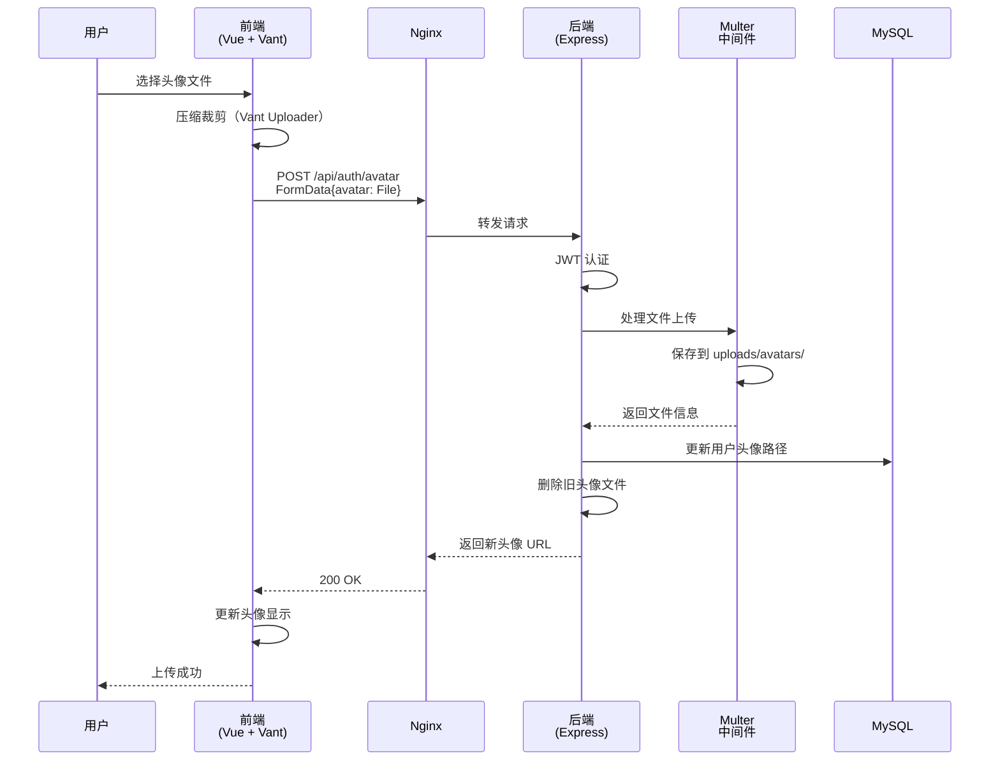

# 头像上传功能完整说明

## 📑 目录

- [功能概述](#功能概述)
- [问题诊断](#问题诊断)
  - [错误现象](#错误现象)
  - [问题根源](#问题根源)
- [技术架构](#技术架构)
  - [前端实现](#前端实现)
  - [后端实现](#后端实现)
  - [上传流程](#上传流程)
- [修复方案](#修复方案)
  - [前端修复](#1-前端修复-最重要)
  - [后端优化](#2-后端优化)
  - [Service Worker 修复](#3-service-worker-修复)
- [环境配置](#环境配置)
  - [开发环境](#开发环境)
  - [生产环境](#生产环境-1panel-部署)
- [Nginx 配置](#nginx-配置)
  - [完整配置](#完整配置示例)
  - [关键配置说明](#关键配置说明)
- [部署步骤](#部署步骤)
  - [前端部署](#1-前端部署)
  - [后端部署](#2-后端部署)
  - [Nginx 配置](#3-nginx-配置)
  - [目录权限](#4-目录权限)
- [测试指南](#测试指南)
  - [本地测试](#本地测试)
  - [生产环境测试](#生产环境测试)
  - [浏览器测试](#浏览器测试)
- [常见问题](#常见问题)
  - [400 Bad Request](#问题-1-400-bad-request---请上传头像文件)
  - [413 Request Entity Too Large](#问题-2-413-request-entity-too-large)
  - [504 Gateway Timeout](#问题-3-504-gateway-timeout)
  - [403 Forbidden](#问题-4-403-forbidden-访问上传的文件)
  - [上传目录不存在](#问题-5-上传目录不存在)
  - [Service Worker 缓存错误](#问题-6-service-worker-缓存错误)
- [监控与日志](#监控与日志)
  - [后端日志](#后端日志)
  - [Nginx 日志](#nginx-日志)
  - [浏览器日志](#浏览器日志)
- [安全建议](#安全建议)
- [性能优化](#性能优化)

---

## 功能概述

用户头像上传是健康管理系统的核心功能之一，支持：
- 图片格式：JPG、JPEG、PNG、GIF、WebP
- 文件大小：最大 5MB
- 自动裁剪、压缩（前端）
- 旧头像自动删除
- 响应式显示

## 问题诊断

### 错误现象

生产环境下头像上传失败，返回 `400 Bad Request`：

```json
{
  "success": false,
  "message": "请上传头像文件"
}
```

**请求信息：**
- URL: `https://healthmanage.xin/api/auth/avatar`
- 方法: `POST`
- 状态码: `400 Bad Request`
- 载荷: `{}`（空对象）

### 问题根源

**前端 API 调用参数顺序错误**，导致文件未正确传递给后端。

```typescript
// ❌ 错误调用
const res = await postAuthAvatar(fileItem.file);
// fileItem.file 被当作 body 参数
// avatar 参数是 undefined

// ✅ 正确调用
const res = await postAuthAvatar({}, fileItem.file);
// 第一个参数：body = {}
// 第二个参数：avatar = fileItem.file
```

## 技术架构

### 前端实现

**技术栈：**
- Vue 3 + TypeScript
- Vant UI 组件库
- Axios 请求库

**核心文件：**
```
src/
├── views/my/index.vue        # 个人中心页面（包含头像上传）
├── api/auth.ts               # 认证相关 API
└── stores/user.ts            # 用户状态管理
```

**API 定义：**
```typescript
// src/api/auth.ts
export async function postAuthAvatar(
  body: {},       // 第一个参数：请求体
  avatar?: File,  // 第二个参数：头像文件
  options?: { [key: string]: any }
) {
  const formData = new FormData();

  if (avatar) {
    formData.append("avatar", avatar);
  }

  Object.keys(body).forEach((ele) => {
    const item = (body as any)[ele];
    if (item !== undefined && item !== null) {
      formData.append(ele, item);
    }
  });

  return request<{
    success?: boolean;
    message?: string;
    data?: { avatarUrl?: string };
  }>("/api/auth/avatar", {
    method: "POST",
    data: formData,
    ...(options || {}),
  });
}
```

### 后端实现

**技术栈：**
- Node.js + Express + TypeScript
- Multer 文件上传中间件
- MySQL 数据库

**核心文件：**
```
src/
├── controllers/authController.ts   # 认证控制器
├── middleware/upload.ts            # 文件上传中间件
├── routes/authRoutes.ts            # 认证路由
└── uploads/avatars/                # 头像存储目录
```

**路由定义：**
```typescript
// src/routes/authRoutes.ts
router.post(
  '/avatar',
  authenticateToken,                    // 1. JWT 认证
  uploadMiddleware.single('avatar'),    // 2. Multer 处理文件
  uploadAvatar                          // 3. 控制器处理
);
```

### 上传流程



## 修复方案

### 1. 前端修复（最重要！）

**文件：** `src/views/my/index.vue`

```typescript
// 修复前（错误）
async function onUpload(file: UploaderFileListItem | UploaderFileListItem[]) {
  const fileItem = Array.isArray(file) ? file[0] : file;

  try {
    const res = await postAuthAvatar(fileItem.file);  // ❌ 错误
    // ...
  }
}

// 修复后（正确）
async function onUpload(file: UploaderFileListItem | UploaderFileListItem[]) {
  const fileItem = Array.isArray(file) ? file[0] : file;

  try {
    const res = await postAuthAvatar({}, fileItem.file);  // ✅ 正确
    // ...
  }
}
```

### 2. 后端优化

**文件：** `src/middleware/upload.ts`

```typescript
import multer from 'multer';
import path from 'path';
import fs from 'fs';

// 上传目录配置（支持环境变量）
const uploadDir = process.env.UPLOAD_PATH
  ? path.resolve(process.env.UPLOAD_PATH, 'avatars')
  : path.join(__dirname, '../uploads/avatars');

// 确保上传目录存在
if (!fs.existsSync(uploadDir)) {
  try {
    fs.mkdirSync(uploadDir, { recursive: true });
    console.log('[Upload] 上传目录创建成功:', uploadDir);
  } catch (error) {
    console.error('[Upload] 上传目录创建失败:', uploadDir, error);
  }
}

console.log('[Upload] 上传目录:', uploadDir);

// 配置存储
const storage = multer.diskStorage({
  destination: function (req, file, cb) {
    cb(null, uploadDir);
  },
  filename: function (req, file, cb) {
    const userId = (req as any).user?.userId || 'unknown';
    const ext = path.extname(file.originalname);
    const filename = `${userId}_${Date.now()}${ext}`;
    cb(null, filename);
  }
});

// 文件过滤器
const fileFilter = (req: any, file: Express.Multer.File, cb: multer.FileFilterCallback) => {
  const allowedMimes = [
    'image/jpeg',
    'image/jpg',
    'image/png',
    'image/gif',
    'image/webp'
  ];

  if (allowedMimes.includes(file.mimetype)) {
    cb(null, true);
  } else {
    cb(new Error('只支持上传图片文件 (jpg, jpeg, png, gif, webp)'));
  }
};

// 创建 multer 实例
export const uploadAvatar = multer({
  storage: storage,
  fileFilter: fileFilter,
  limits: {
    fileSize: 5 * 1024 * 1024 // 限制 5MB
  }
});
```

**文件：** `src/controllers/authController.ts`

```typescript
export const uploadAvatar = async (
  req: AuthRequest,
  res: Response
): Promise<void> => {
  try {
    // 调试日志
    console.log('[Upload] 收到头像上传请求', {
      userId: req.user?.userId,
      hasFile: !!req.file,
      contentType: req.headers['content-type'],
      bodyKeys: Object.keys(req.body),
      fileKeys: req.file ? Object.keys(req.file) : []
    });

    if (!req.file) {
      console.error('[Upload] 未检测到文件，可能原因：', {
        contentType: req.headers['content-type'],
        body: req.body,
        files: (req as any).files
      });
      res.status(400).json({
        success: false,
        message: "请上传头像文件",
      });
      return;
    }

    console.log('[Upload] 文件信息:', {
      filename: req.file.filename,
      originalname: req.file.originalname,
      mimetype: req.file.mimetype,
      size: req.file.size,
      path: req.file.path
    });

    // 生成头像URL路径
    const avatarUrl = `/uploads/avatars/${req.file.filename}`;

    // 查询用户旧头像
    const [rows] = await db.execute(
      "SELECT avatar FROM users WHERE id = ?",
      [req.user?.userId]
    );

    const users = rows as any[];
    const oldAvatar = users[0]?.avatar;

    // 更新数据库中的头像路径
    await db.execute(
      "UPDATE users SET avatar = ? WHERE id = ?",
      [avatarUrl, req.user?.userId]
    );

    // 删除旧头像文件（如果存在且不是默认头像）
    if (oldAvatar && oldAvatar.startsWith("/uploads/avatars/")) {
      const oldAvatarPath = path.join(__dirname, "../../", oldAvatar);
      if (fs.existsSync(oldAvatarPath)) {
        fs.unlinkSync(oldAvatarPath);
      }
    }

    res.json({
      success: true,
      message: "头像上传成功",
      data: {
        avatarUrl,
      },
    });
  } catch (error) {
    console.error("上传头像错误:", error);

    // 如果发生错误，删除已上传的文件
    if (req.file) {
      const uploadedFilePath = req.file.path;
      if (fs.existsSync(uploadedFilePath)) {
        fs.unlinkSync(uploadedFilePath);
      }
    }

    res.status(500).json({
      success: false,
      message: "服务器内部错误",
    });
  }
};
```

### 3. Service Worker 修复

**问题：** `Failed to execute 'put' on 'Cache': Request method 'POST' is unsupported`

**原因：** Cache API 只支持缓存 GET 请求，不支持 POST/PUT/DELETE 等方法。

**文件：** `public/sw.js`

```javascript
// 修复前
async function cacheFirstStrategy(request) {
  try {
    const networkResponse = await fetch(request);

    if (networkResponse.ok) {
      const cache = await caches.open(CACHE_NAME);
      cache.put(request, networkResponse.clone());  // ❌ 可能缓存 POST 请求
    }

    return networkResponse;
  } catch (error) {
    // ...
  }
}

// 修复后
async function cacheFirstStrategy(request) {
  try {
    const networkResponse = await fetch(request);

    // 只缓存 GET 请求
    if (networkResponse.ok && request.method === 'GET') {  // ✅ 添加 GET 检查
      const cache = await caches.open(CACHE_NAME);
      cache.put(request, networkResponse.clone());
    }

    return networkResponse;
  } catch (error) {
    // ...
  }
}
```

**版本号更新：**
```javascript
// 更新版本号以触发 Service Worker 更新
const CACHE_VERSION = 'v1.0.1';  // 从 v1.0.0 升级到 v1.0.1
const CACHE_NAME = `health-app-${CACHE_VERSION}`;
```

## 环境配置

### 开发环境

**`.env` 文件：**
```bash
NODE_ENV=development
PORT=3000

# 数据库配置
DB_HOST=localhost
DB_PORT=3306
DB_USER=root
DB_PASSWORD=000000
DB_NAME=health_management

# JWT 配置
JWT_SECRET=health_system_jwt_secret_key_2024
JWT_EXPIRES_IN=7d

# CORS 配置
CORS_ORIGIN=http://localhost:5173,http://localhost:8868

# 文件上传配置（开发环境留空，使用默认相对路径）
UPLOAD_PATH=
MAX_FILE_SIZE=5242880
```

### 生产环境 (1Panel 部署)

**`.env` 文件：**
```bash
NODE_ENV=production
PORT=3000

# 数据库配置
DB_HOST=localhost
DB_PORT=3306
DB_USER=root
DB_PASSWORD=your_production_password
DB_NAME=health_management

# JWT 配置
JWT_SECRET=your_production_secret_key
JWT_EXPIRES_IN=7d

# CORS 配置
CORS_ORIGIN=https://healthmanage.xin

# 文件上传配置（生产环境使用绝对路径）
UPLOAD_PATH=/opt/1panel/www/sites/healthbackend/index/server_upload/uploads
MAX_FILE_SIZE=5242880
```

## Nginx 配置

### 完整配置示例

```nginx
server {
    listen 80;
    listen 443 ssl http2;
    server_name healthmanage.xin;

    # SSL 证书配置
    ssl_certificate /path/to/your/certificate.crt;
    ssl_certificate_key /path/to/your/private.key;

    # ========== 文件上传关键配置 ==========

    # 1. 文件大小限制（必须大于后端限制）
    client_max_body_size 10M;

    # 2. 请求体缓冲大小
    client_body_buffer_size 128k;

    # 3. 超时设置
    proxy_connect_timeout 600;
    proxy_send_timeout 600;
    proxy_read_timeout 600;
    send_timeout 600;

    # ========== 前端静态文件 ==========
    location / {
        root /var/www/h5-app/dist;
        try_files $uri $uri/ /index.html;

        # 缓存策略
        location ~* \.(js|css|png|jpg|jpeg|gif|ico|svg|woff|woff2|ttf|eot)$ {
            expires 7d;
            add_header Cache-Control "public, immutable";
        }
    }

    # ========== API 反向代理 ==========
    location /api/ {
        proxy_pass http://127.0.0.1:3000;

        # 保留原始请求头
        proxy_set_header Host $host;
        proxy_set_header X-Real-IP $remote_addr;
        proxy_set_header X-Forwarded-For $proxy_add_x_forwarded_for;
        proxy_set_header X-Forwarded-Proto $scheme;

        # 文件上传必需配置
        proxy_set_header Connection "";
        proxy_http_version 1.1;

        # 禁用请求体缓冲（大文件上传）
        proxy_request_buffering off;

        # 超时时间
        proxy_connect_timeout 600s;
        proxy_send_timeout 600s;
        proxy_read_timeout 600s;
    }

    # ========== 上传文件静态资源服务 ==========
    location /uploads/ {
        # 1Panel 部署路径
        alias /opt/1panel/www/sites/healthbackend/index/server_upload/uploads/;

        # 访问控制
        add_header Access-Control-Allow-Origin *;
        add_header Access-Control-Allow-Methods 'GET, OPTIONS';

        # 缓存策略
        expires 30d;
        add_header Cache-Control "public, immutable";

        # 安全设置
        autoindex off;
    }

    # 日志
    access_log /var/log/nginx/healthmanage.access.log;
    error_log /var/log/nginx/healthmanage.error.log;
}
```

### 关键配置说明

| 配置项 | 说明 | 推荐值 |
|--------|------|--------|
| `client_max_body_size` | 客户端请求体最大大小 | `10M` |
| `client_body_buffer_size` | 请求体缓冲区大小 | `128k` |
| `proxy_request_buffering` | 禁用请求体缓冲 | `off` |
| `proxy_connect_timeout` | 连接超时时间 | `600s` |
| `proxy_send_timeout` | 发送超时时间 | `600s` |
| `proxy_read_timeout` | 读取超时时间 | `600s` |
| `alias` | 上传文件存储路径 | `/opt/1panel/www/.../uploads/` |

## 部署步骤

### 1. 前端部署

```bash
# 1. 更新代码
cd /path/to/frontend/h5-app
git pull origin main

# 2. 安装依赖
npm install

# 3. 构建生产版本
npm run build

# 4. 上传到服务器（方式一：直接复制）
scp -r dist/* user@healthmanage.xin:/var/www/h5-app/

# 或（方式二：通过 1Panel 上传）
# 将 dist 目录内容上传到 1Panel 网站目录
```

### 2. 后端部署

```bash
# 1. 更新代码
cd /opt/1panel/www/sites/healthbackend/index
git pull origin main

# 2. 安装依赖
pnpm install

# 3. 构建
pnpm run build

# 4. 配置环境变量
vim .env
# 添加 UPLOAD_PATH=/opt/1panel/www/sites/healthbackend/index/server_upload/uploads

# 5. 重启服务
pm2 restart health-backend

# 6. 查看日志
pm2 logs health-backend --lines 50
```

### 3. Nginx 配置

```bash
# 1. 编辑 Nginx 配置
sudo vim /etc/nginx/sites-available/healthmanage.xin

# 2. 测试配置
sudo nginx -t

# 3. 重新加载 Nginx
sudo nginx -s reload
# 或
sudo systemctl reload nginx
```

### 4. 目录权限

```bash
# 1. 创建上传目录
sudo mkdir -p /opt/1panel/www/sites/healthbackend/index/server_upload/uploads/avatars

# 2. 设置权限（重要！）
sudo chown -R www-data:www-data /opt/1panel/www/sites/healthbackend/index/server_upload/uploads
sudo chmod -R 755 /opt/1panel/www/sites/healthbackend/index/server_upload/uploads

# 3. 验证权限
ls -la /opt/1panel/www/sites/healthbackend/index/server_upload/uploads/

# 应该看到：
# drwxr-xr-x 2 www-data www-data 4096 ... avatars
```

## 测试指南

### 本地测试

```bash
# 1. 启动后端
cd backend/health-backend
pnpm run dev

# 2. 启动前端
cd frontend/h5-app
npm run dev

# 3. 浏览器访问
# http://localhost:5173
# 登录后进入个人中心，点击头像上传
```

### 生产环境测试

**使用 curl 命令：**

```bash
# 1. 先登录获取 Token
curl -X POST https://healthmanage.xin/api/auth/login \
  -H "Content-Type: application/json" \
  -d '{"username": "test", "password": "123456"}'

# 返回示例：
# {"success":true,"data":{"token":"eyJhbGciOi...","user":{...}}}

# 2. 复制 token，上传头像
TOKEN="eyJhbGciOi..."

curl -X POST https://healthmanage.xin/api/auth/avatar \
  -H "Authorization: Bearer $TOKEN" \
  -F "avatar=@/path/to/test.jpg" \
  -v

# 成功响应：
# {
#   "success": true,
#   "message": "头像上传成功",
#   "data": {
#     "avatarUrl": "/uploads/avatars/1_1234567890.jpg"
#   }
# }
```

### 浏览器测试

1. 打开 `https://healthmanage.xin`
2. 登录账号
3. 进入「个人中心」
4. 点击头像，选择图片上传
5. 打开浏览器控制台，查看网络请求
6. 检查请求和响应是否正常

**预期流程：**
```
1. POST /api/auth/avatar
   - Status: 200 OK
   - Content-Type: multipart/form-data
   - Response: {"success":true,"data":{"avatarUrl":"..."}}

2. GET /uploads/avatars/xxx.jpg
   - Status: 200 OK
   - Content-Type: image/jpeg
```

## 常见问题

### 问题 1: `400 Bad Request - "请上传头像文件"`

**原因：**
- 前端 API 调用参数顺序错误
- FormData 中没有 `avatar` 字段

**解决：**
```typescript
// 修改 src/views/my/index.vue:190
const res = await postAuthAvatar({}, fileItem.file);
```

**验证：**
```bash
# 查看后端日志
pm2 logs health-backend --lines 100

# 应该看到：
# [Upload] 收到头像上传请求 { userId: 1, hasFile: true, ... }
```

### 问题 2: `413 Request Entity Too Large`

**原因：** Nginx 文件大小限制

**解决：**
```nginx
# 编辑 Nginx 配置
client_max_body_size 10M;

# 重新加载
sudo nginx -s reload
```

### 问题 3: `504 Gateway Timeout`

**原因：** 上传超时

**解决：**
```nginx
# 增加超时时间
proxy_connect_timeout 600s;
proxy_send_timeout 600s;
proxy_read_timeout 600s;

# 重新加载
sudo nginx -s reload
```

### 问题 4: `403 Forbidden` (访问上传的文件)

**原因：** 文件权限问题

**解决：**
```bash
sudo chown -R www-data:www-data /opt/1panel/www/sites/healthbackend/index/server_upload/uploads
sudo chmod -R 755 /opt/1panel/www/sites/healthbackend/index/server_upload/uploads
```

### 问题 5: 上传目录不存在

**原因：** `UPLOAD_PATH` 环境变量未配置或目录不存在

**解决：**
```bash
# 1. 创建目录
sudo mkdir -p /opt/1panel/www/sites/healthbackend/index/server_upload/uploads/avatars

# 2. 设置权限
sudo chown -R www-data:www-data /opt/1panel/www/sites/healthbackend/index/server_upload/uploads
sudo chmod -R 755 /opt/1panel/www/sites/healthbackend/index/server_upload/uploads

# 3. 配置环境变量
cd /opt/1panel/www/sites/healthbackend/index
vim .env

# 添加：
UPLOAD_PATH=/opt/1panel/www/sites/healthbackend/index/server_upload/uploads

# 4. 重启服务
pm2 restart health-backend
```

### 问题 6: Service Worker 缓存错误

**错误：** `Failed to execute 'put' on 'Cache': Request method 'POST' is unsupported`

**原因：** Cache API 不支持缓存 POST 请求

**解决：** 已在 `sw.js v1.0.1` 中修复

```javascript
// public/sw.js:107-112
if (networkResponse.ok && request.method === 'GET') {
  const cache = await caches.open(CACHE_NAME);
  cache.put(request, networkResponse.clone());
}
```

**清除旧缓存：**
```javascript
// 浏览器控制台执行
navigator.serviceWorker.getRegistrations().then(registrations => {
  registrations.forEach(reg => reg.unregister());
});

caches.keys().then(names => {
  names.forEach(name => caches.delete(name));
});

// 然后刷新页面
location.reload();
```

## 监控与日志

### 后端日志

```bash
# PM2 实时日志
pm2 logs health-backend --lines 100

# 查看特定时间范围
pm2 logs health-backend --timestamp --lines 200

# 只看错误日志
pm2 logs health-backend --err --lines 50
```

**日志示例：**
```
[Upload] 上传目录: /opt/1panel/www/sites/healthbackend/index/server_upload/uploads/avatars
[Upload] 收到头像上传请求 {
  userId: 1,
  hasFile: true,
  contentType: 'multipart/form-data; boundary=...',
  bodyKeys: [],
  fileKeys: [ 'fieldname', 'originalname', 'encoding', 'mimetype', 'destination', 'filename', 'path', 'size' ]
}
[Upload] 文件信息: {
  filename: '1_1734567890123.jpg',
  originalname: 'avatar.jpg',
  mimetype: 'image/jpeg',
  size: 51234,
  path: '/opt/.../uploads/avatars/1_1734567890123.jpg'
}
```

### Nginx 日志

```bash
# 访问日志
sudo tail -f /var/log/nginx/healthmanage.access.log

# 错误日志
sudo tail -f /var/log/nginx/healthmanage.error.log

# 查看最近的上传请求
sudo grep "POST.*avatar" /var/log/nginx/healthmanage.access.log | tail -20
```

### 浏览器日志

**打开开发者工具：**
1. F12 或 右键 → 检查
2. 切换到「Network」标签
3. 筛选 `avatar`
4. 查看请求详情：
   - Request Headers
   - Request Payload
   - Response Headers
   - Response Body

**控制台日志：**
```javascript
// 查看 Service Worker 状态
navigator.serviceWorker.getRegistrations().then(regs => {
  console.log('Service Workers:', regs);
});

// 查看缓存状态
caches.keys().then(names => {
  console.log('Caches:', names);
});
```

## 安全建议

### 1. 文件类型验证

**后端已配置：**
```typescript
const allowedMimes = [
  'image/jpeg',
  'image/jpg',
  'image/png',
  'image/gif',
  'image/webp'
];
```

**前端也应验证：**
```typescript
// Vant Uploader 配置
<van-uploader
  accept="image/*"
  :max-size="5 * 1024 * 1024"
  @oversize="onOversize"
/>
```

### 2. 文件大小限制

- **前端限制**：5MB（Vant Uploader）
- **后端限制**：5MB（Multer）
- **Nginx 限制**：10MB（留有余量）

### 3. 防止目录遍历

```nginx
location /uploads/ {
    autoindex off;  # 禁止目录列表
}
```

### 4. 定期清理

```bash
# 设置定时任务清理 90 天前的旧头像
# crontab -e
0 2 * * * find /opt/1panel/www/sites/healthbackend/index/server_upload/uploads/avatars -mtime +90 -type f -delete
```

### 5. 文件名随机化

已实现：`{userId}_{timestamp}.{ext}`

### 6. 访问控制

```nginx
location /uploads/ {
    # 只允许 GET 和 OPTIONS
    add_header Access-Control-Allow-Methods 'GET, OPTIONS';

    # 限制来源（可选）
    # add_header Access-Control-Allow-Origin 'https://healthmanage.xin';
}
```

## 性能优化

### 1. 前端压缩

```typescript
// Vant Uploader 自动压缩
<van-uploader
  :before-read="beforeRead"
  :compress="true"
  :compress-quality="0.8"
/>
```

### 2. CDN 加速

```nginx
# 使用 CDN 加速静态资源
location /uploads/ {
    # 配置 CDN 回源
    add_header 'Access-Control-Allow-Origin' '*';
    expires 30d;
}
```

### 3. 响应式图片

```typescript
// 根据设备显示不同尺寸

```

### 4. 懒加载

```vue
<van-image
  :src="avatarUrl"
  lazy-load
  loading="加载中..."
  error="加载失败"
/>
```

---

## 总结

头像上传功能的核心问题和解决方案：

| 问题 | 原因 | 解决方案 | 状态 |
|------|------|----------|------|
| 400 Bad Request | 前端 API 参数错误 | 修改调用顺序 | ✅ 已修复 |
| POST 缓存错误 | Service Worker 缓存逻辑 | 只缓存 GET 请求 | ✅ 已修复 |
| 文件大小限制 | Nginx 默认 1MB | 调整为 10MB | ✅ 已配置 |
| 超时问题 | 上传时间过长 | 增加超时时间 | ✅ 已配置 |
| 权限问题 | 目录权限不足 | 设置 755 权限 | ✅ 已配置 |

**关键配置检查清单：**
- [x] 前端 API 调用正确：`postAuthAvatar({}, file)`
- [x] 后端环境变量：`UPLOAD_PATH` 已配置
- [x] Nginx 文件大小：`client_max_body_size 10M`
- [x] Nginx 超时设置：`proxy_*_timeout 600s`
- [x] 上传目录权限：`755` + `www-data:www-data`
- [x] Service Worker：v1.0.1（已修复 POST 缓存）

按照本文档部署后，头像上传功能应该可以正常工作。如有问题，请查看[监控与日志](#监控与日志)章节进行排查。
