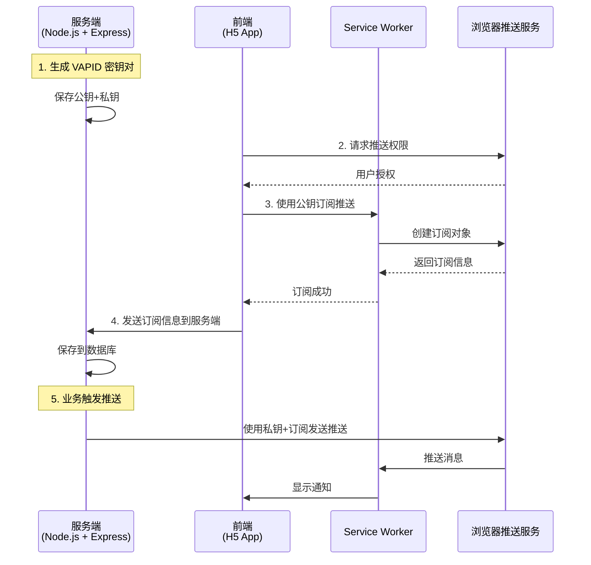
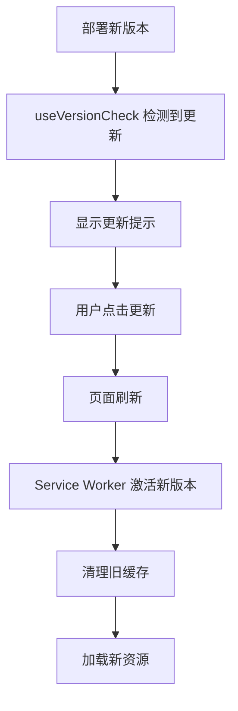

# PWA (Progressive Web App) 使用说明

## 📑 目录

- [功能概述](#功能概述)
- [主要特性](#主要特性)
  - [已实现功能](#-已实现功能)
- [文件结构](#文件结构)
- [配置说明](#配置说明)
  - [manifest.json](#1-manifestjson)
  - [核心代码说明](#2-核心代码说明)
- [图标替换指南](#图标替换指南)
- [浏览器兼容性](#浏览器兼容性)
- [iOS 设备安装指南](#ios-设备安装指南)
- [测试指南](#测试指南)
  - [本地测试](#本地测试)
  - [生产环境部署](#生产环境部署)
- [用户体验优化建议](#用户体验优化建议)
- [常见问题](#常见问题)
- [性能指标](#性能指标)
- [Service Worker 功能](#service-worker-功能)
  - [已实现功能](#-已实现功能-1)
  - [离线缓存策略](#1-离线缓存策略)
  - [后台同步](#2-后台同步-background-sync)
  - [推送通知](#3-推送通知-push-notifications)
  - [服务端推送通知实现](#-服务端推送通知实现)
  - [缓存配置](#-缓存配置)
  - [更新机制](#-更新机制)
  - [后台同步使用](#-后台同步使用)
  - [推送通知使用](#-推送通知使用)
  - [实用工具函数](#-实用工具函数)
  - [调试 Service Worker](#-调试-service-worker)
  - [生产环境配置](#-生产环境配置)
  - [性能监控](#-性能监控)
  - [注意事项](#-注意事项)
- [下一步优化方向](#下一步优化方向)
- [技术支持](#技术支持)

---

## 功能概述

本应用已支持 PWA（渐进式 Web 应用）功能，用户可以将应用安装到设备主屏幕，获得类似原生应用的体验。

## 主要特性

### ✅ 已实现功能

1. **安装提示**
   - 自动检测浏览器是否支持 PWA 安装
   - 用户首次访问应用 3 秒后显示安装提示
   - 精美的安装引导 UI，包含应用图标、功能介绍
   - 支持"立即安装"和"稍后再说"选项

2. **智能提醒机制**
   - 用户选择"稍后再说"后，7 天内不再显示提示
   - 已安装用户自动隐藏安装提示
   - 支持跨标签页状态同步

3. **应用配置 (manifest.json)**
   - 应用名称：健康管理系统
   - 显示模式：独立窗口（standalone）
   - 主题颜色：#1989fa（科技蓝）
   - 方向锁定：竖屏（portrait）
   - 支持应用图标和启动画面

4. **响应式设计**
   - 移动端：底部滑出式提示卡片
   - 桌面端：居中弹窗式提示
   - 支持暗黑模式适配

5. **国际化支持**
   - 中文和英文双语支持
   - 所有提示文本均支持多语言切换

## 文件结构

```
h5-app/
├── public/
│   ├── manifest.json                 # PWA 配置文件
│   ├── pwa-icon-192.png             # 应用图标 192x192 (待替换)
│   └── pwa-icon-512.png             # 应用图标 512x512 (待替换)
├── src/
│   ├── components/
│   │   └── PwaInstallPrompt.vue     # PWA 安装提示组件
│   ├── App.vue                      # 主应用（已集成提示组件）
│   └── locales/
│       ├── zh-CN.json               # 中文国际化文本
│       └── en-US.json               # 英文国际化文本
└── index.html                       # 已添加 manifest 和 meta 标签
```

## 配置说明

### 1. manifest.json

```json
{
  "name": "健康管理系统",
  "short_name": "健康管理",
  "description": "智能健康管理与饮食追踪应用",
  "start_url": "/",
  "display": "standalone",
  "background_color": "#ffffff",
  "theme_color": "#1989fa",
  "orientation": "portrait",
  "scope": "/",
  "icons": [
    {
      "src": "/pwa-icon-192.png",
      "sizes": "192x192",
      "type": "image/png",
      "purpose": "any maskable"
    },
    {
      "src": "/pwa-icon-512.png",
      "sizes": "512x512",
      "type": "image/png",
      "purpose": "any maskable"
    }
  ]
}
```

**配置说明：**
- `display: "standalone"`: 独立窗口模式，隐藏浏览器 UI
- `orientation: "portrait"`: 锁定为竖屏模式
- `theme_color`: 状态栏颜色
- `icons`: 支持 `any` 和 `maskable` 两种用途，确保在所有平台显示正常

### 2. 核心代码说明

**PwaInstallPrompt.vue 组件核心逻辑：**

```typescript
// 检测是否应该显示提示
function shouldShowPrompt(): boolean {
  // 1. 检查是否已经是PWA模式
  if (window.matchMedia("(display-mode: standalone)").matches) {
    return false;
  }

  // 2. 检查iOS设备独立模式
  const isIOS = /iPad|iPhone|iPod/.test(navigator.userAgent);
  const isInStandaloneMode = (window.navigator as any).standalone;
  if (isIOS && isInStandaloneMode) {
    return false;
  }

  // 3. 检查用户是否最近关闭过提示（7天内）
  const dismissedTime = localStorage.getItem(STORAGE_KEY);
  if (dismissedTime) {
    const timePassed = Date.now() - parseInt(dismissedTime);
    if (timePassed < DISMISS_DURATION) {
      return false;
    }
  }

  return true;
}

// 处理安装
async function handleInstall() {
  if (!deferredPrompt.value) return;

  // 触发浏览器安装提示
  deferredPrompt.value.prompt();

  // 等待用户响应
  const { outcome } = await deferredPrompt.value.userChoice;

  console.log(`PWA安装结果: ${outcome}`);
  deferredPrompt.value = null;
  showPrompt.value = false;
}
```

## 图标替换指南

### 📦 需要替换的图标文件

在 `public/` 目录下创建或替换以下图标文件：

1. **pwa-icon-192.png** (192x192 像素)
   - 用途：主屏幕图标、任务切换器
   - 格式：PNG，透明背景
   - 建议：使用圆角矩形或圆形图标

2. **pwa-icon-512.png** (512x512 像素)
   - 用途：启动画面、应用商店
   - 格式：PNG，透明背景
   - 建议：高质量图标，清晰锐利

### 🎨 图标设计建议

1. **图标内容**
   - 使用应用的核心标识（如心形+十字医疗标志）
   - 简洁明了，易于识别
   - 避免过多文字

2. **颜色方案**
   - 主色：#1989fa（科技蓝）
   - 辅助色：白色
   - 背景：可以是纯色或渐变

3. **maskable 图标**
   - 确保重要内容在中心 80% 的安全区域内
   - 四周留有适当的边距（至少 10%）

### 🔧 在线图标生成工具

推荐使用以下工具生成 PWA 图标：

1. **PWA Asset Generator**
   - 网址：https://www.pwabuilder.com/imageGenerator
   - 功能：上传一张图片自动生成全套 PWA 图标

2. **RealFaviconGenerator**
   - 网址：https://realfavicongenerator.net/
   - 功能：生成多平台适配图标

3. **Figma / Sketch / Adobe XD**
   - 使用设计工具手动创建，导出为 PNG

### 📝 替换步骤

1. 准备好 512x512 的高质量图标源文件
2. 使用在线工具或图像编辑软件生成不同尺寸
3. 将生成的图标文件放入 `public/` 目录
4. 确保文件名与 `manifest.json` 中配置一致
5. 测试图标在不同设备上的显示效果

## 浏览器兼容性

### ✅ 完全支持
- **Chrome/Edge** (79+): 完整的 PWA 支持，包括安装提示
- **Safari** (iOS 11.3+, macOS): 支持添加到主屏幕，需手动操作
- **Firefox** (79+): 支持 PWA 安装
- **Samsung Internet** (4.0+): 完整支持

### ⚠️ 部分支持
- **Safari (iOS)**:
  - 不支持 `beforeinstallprompt` 事件
  - 需要用户手动通过"分享"→"添加到主屏幕"
  - 组件会自动隐藏安装提示

### ❌ 不支持
- IE 11 及更早版本
- 旧版本浏览器（Chrome < 79）

## iOS 设备安装指南

由于 iOS Safari 不支持自动安装提示，用户需要手动安装：

### 安装步骤：

1. 在 Safari 浏览器中打开应用
2. 点击底部工具栏的"分享"按钮 📤
3. 滑动找到"添加到主屏幕"
4. 编辑应用名称（可选）
5. 点击"添加"

安装后，应用图标会出现在主屏幕上，点击即可快速启动。

## 测试指南

### 本地测试

1. **HTTPS 要求**
   ```bash
   # PWA 需要 HTTPS 环境（localhost 除外）
   npm run dev  # 开发环境可以使用 http://localhost
   ```

2. **Chrome DevTools 测试**
   - 打开 Chrome DevTools
   - 切换到 "Application" 标签
   - 左侧选择 "Manifest" 检查配置
   - 左侧选择 "Service Workers" 检查服务状态

3. **安装提示测试**
   ```javascript
   // 在控制台清除安装记录
   localStorage.removeItem('pwa_install_prompt_dismissed');
   // 刷新页面，3秒后应显示安装提示
   ```

### 生产环境部署

1. **确保 HTTPS**
   ```nginx
   # Nginx 配置示例
   server {
       listen 443 ssl http2;
       server_name yourdomain.com;

       ssl_certificate /path/to/cert.pem;
       ssl_certificate_key /path/to/key.pem;

       location / {
           root /path/to/dist;
           try_files $uri $uri/ /index.html;
       }
   }
   ```

2. **正确的 MIME 类型**
   ```nginx
   location ~ \.json$ {
       add_header Content-Type application/json;
   }
   ```

3. **缓存策略**
   ```nginx
   # manifest.json 不缓存，确保及时更新
   location = /manifest.json {
       add_header Cache-Control "no-cache, no-store, must-revalidate";
   }

   # 图标文件可以长期缓存
   location ~* \.(png|jpg|jpeg|svg|ico)$ {
       expires 1y;
       add_header Cache-Control "public, immutable";
   }
   ```

## 用户体验优化建议

### 1. 首次加载优化
- ✅ 已实现 3 秒延迟显示，避免打扰用户
- 建议：在用户完成首次核心操作后再显示提示

### 2. 提示时机
- ✅ 当前在应用启动后 3 秒显示
- 可优化：在用户浏览 2-3 个页面后显示
- 可优化：在用户完成首次打卡后显示

### 3. 视觉设计
- ✅ 响应式设计，适配移动端和桌面端
- ✅ 精美的动画效果
- ✅ 暗黑模式适配

## 常见问题

### Q1: 安装提示不显示？
**可能原因：**
- 已经在 PWA 模式下运行
- 7 天内用户点击过"稍后再说"
- 浏览器不支持（如 iOS Safari）
- 不在 HTTPS 环境下

**解决方法：**
```javascript
// 清除本地记录并刷新
localStorage.removeItem('pwa_install_prompt_dismissed');
location.reload();
```

### Q2: iOS 设备为什么没有安装提示？
**答：** iOS Safari 不支持 `beforeinstallprompt` 事件，组件会自动检测并隐藏提示。iOS 用户需要手动通过"添加到主屏幕"安装。

### Q3: 如何卸载 PWA？
**Android/Chrome:**
1. 长按应用图标
2. 选择"应用信息"
3. 点击"卸载"

**iOS:**
1. 长按应用图标
2. 点击"删除 App"

### Q4: 图标显示不正确？
**检查清单：**
- [ ] 图标文件路径是否正确
- [ ] 图标尺寸是否符合要求（192x192, 512x512）
- [ ] manifest.json 配置是否正确
- [ ] 清除浏览器缓存后重试

## 性能指标

PWA 应用应达到以下性能标准：

- ⚡ **首次内容绘制 (FCP)**: < 1.8s
- ⚡ **最大内容绘制 (LCP)**: < 2.5s
- ⚡ **首次输入延迟 (FID)**: < 100ms
- ⚡ **累积布局偏移 (CLS)**: < 0.1

使用 Chrome Lighthouse 进行测试：
1. 打开 Chrome DevTools
2. 切换到 "Lighthouse" 标签
3. 选择 "Progressive Web App"
4. 点击 "Generate report"

## Service Worker 功能

### ✅ 已实现功能

#### 1. **离线缓存策略**

**缓存优先 (Cache First)**
- 适用于：静态资源（HTML、CSS、JS、图片等）
- 流程：先查缓存 → 未命中则请求网络 → 存入缓存
- 优点：快速响应，减少网络请求

**网络优先 (Network First)**
- 适用于：API 请求、动态数据
- 流程：先请求网络 → 失败则返回缓存 → 成功则更新缓存
- 优点：保证数据最新，支持离线降级

#### 2. **后台同步 (Background Sync)**
- 自动检测网络恢复
- 同步待上传的健康数据和饮食记录
- 失败自动重试

#### 3. **推送通知 (Push Notifications)**
- 支持服务端推送提醒
- 用户可点击通知快速访问
- 支持自定义通知操作按钮

---

### 📮 服务端推送通知实现

#### 推送通知工作流程



#### 1️⃣ 后端实现（基于你的 health-backend）

##### 安装依赖

```bash
cd backend/health-backend
pnpm add web-push
pnpm add -D @types/web-push
```

##### 生成 VAPID 密钥

```typescript
// scripts/generate-vapid-keys.ts
import webpush from 'web-push';

const vapidKeys = webpush.generateVAPIDKeys();

console.log('VAPID Public Key:', vapidKeys.publicKey);
console.log('VAPID Private Key:', vapidKeys.privateKey);
console.log('\n将以下配置添加到 .env 文件:');
console.log(`VAPID_PUBLIC_KEY=${vapidKeys.publicKey}`);
console.log(`VAPID_PRIVATE_KEY=${vapidKeys.privateKey}`);
console.log(`VAPID_SUBJECT=mailto:your-email@example.com`);
```

运行生成密钥：
```bash
npx ts-node scripts/generate-vapid-keys.ts
```

##### 添加环境变量

```bash
# .env
VAPID_PUBLIC_KEY=YOUR_GENERATED_PUBLIC_KEY
VAPID_PRIVATE_KEY=YOUR_GENERATED_PRIVATE_KEY
VAPID_SUBJECT=mailto:your-email@example.com
```

##### 创建推送通知控制器

```typescript
// src/controllers/pushController.ts
import { Response } from 'express';
import webpush from 'web-push';
import { AuthRequest } from '../middleware/auth';
import db from '../config/database';

// 配置 VAPID
webpush.setVapidDetails(
  process.env.VAPID_SUBJECT || 'mailto:admin@health-app.com',
  process.env.VAPID_PUBLIC_KEY || '',
  process.env.VAPID_PRIVATE_KEY || ''
);

/**
 * @swagger
 * /api/push/vapid-public-key:
 *   get:
 *     summary: 获取 VAPID 公钥
 *     tags: [推送通知]
 *     responses:
 *       200:
 *         description: 返回公钥
 */
export const getVapidPublicKey = async (req: AuthRequest, res: Response): Promise<void> => {
  res.json({
    success: true,
    data: {
      publicKey: process.env.VAPID_PUBLIC_KEY
    }
  });
};

/**
 * @swagger
 * /api/push/subscribe:
 *   post:
 *     summary: 保存推送订阅
 *     tags: [推送通知]
 *     security:
 *       - bearerAuth: []
 *     requestBody:
 *       required: true
 *       content:
 *         application/json:
 *           schema:
 *             type: object
 *             properties:
 *               subscription:
 *                 type: object
 */
export const subscribe = async (req: AuthRequest, res: Response): Promise<void> => {
  try {
    const userId = req.user?.userId;
    const { subscription } = req.body;

    if (!subscription) {
      res.status(400).json({
        success: false,
        message: '缺少订阅信息'
      });
      return;
    }

    // 保存订阅信息到数据库
    const query = `
      INSERT INTO push_subscriptions
      (user_id, endpoint, p256dh_key, auth_key, created_at, updated_at)
      VALUES (?, ?, ?, ?, NOW(), NOW())
      ON DUPLICATE KEY UPDATE
        endpoint = VALUES(endpoint),
        p256dh_key = VALUES(p256dh_key),
        auth_key = VALUES(auth_key),
        updated_at = NOW()
    `;

    await db.execute(query, [
      userId,
      subscription.endpoint,
      subscription.keys.p256dh,
      subscription.keys.auth
    ]);

    res.json({
      success: true,
      message: '推送订阅保存成功'
    });
  } catch (error: any) {
    console.error('保存推送订阅失败:', error);
    res.status(500).json({
      success: false,
      message: '保存推送订阅失败',
      error: error.message
    });
  }
};

/**
 * @swagger
 * /api/push/unsubscribe:
 *   post:
 *     summary: 取消推送订阅
 *     tags: [推送通知]
 *     security:
 *       - bearerAuth: []
 */
export const unsubscribe = async (req: AuthRequest, res: Response): Promise<void> => {
  try {
    const userId = req.user?.userId;

    const query = 'DELETE FROM push_subscriptions WHERE user_id = ?';
    await db.execute(query, [userId]);

    res.json({
      success: true,
      message: '取消推送订阅成功'
    });
  } catch (error: any) {
    console.error('取消推送订阅失败:', error);
    res.status(500).json({
      success: false,
      message: '取消推送订阅失败',
      error: error.message
    });
  }
};

/**
 * @swagger
 * /api/push/send:
 *   post:
 *     summary: 发送推送通知
 *     tags: [推送通知]
 *     security:
 *       - bearerAuth: []
 *     requestBody:
 *       required: true
 *       content:
 *         application/json:
 *           schema:
 *             type: object
 *             properties:
 *               userId:
 *                 type: integer
 *               title:
 *                 type: string
 *               body:
 *                 type: string
 *               data:
 *                 type: object
 */
export const sendNotification = async (req: AuthRequest, res: Response): Promise<void> => {
  try {
    const { userId, title, body, data } = req.body;

    // 获取用户的推送订阅信息
    const query = `
      SELECT endpoint, p256dh_key, auth_key
      FROM push_subscriptions
      WHERE user_id = ?
    `;
    const [rows]: any = await db.execute(query, [userId]);

    if (rows.length === 0) {
      res.status(404).json({
        success: false,
        message: '用户未订阅推送通知'
      });
      return;
    }

    const subscription = {
      endpoint: rows[0].endpoint,
      keys: {
        p256dh: rows[0].p256dh_key,
        auth: rows[0].auth_key
      }
    };

    // 构造推送消息
    const payload = JSON.stringify({
      title: title || '健康管理提醒',
      body: body || '您有新的健康提醒',
      icon: '/pwa-icon/192.png',
      badge: '/pwa-icon/192.png',
      data: data || {}
    });

    // 发送推送通知
    await webpush.sendNotification(subscription, payload);

    res.json({
      success: true,
      message: '推送通知已发送'
    });
  } catch (error: any) {
    console.error('发送推送通知失败:', error);

    // 如果订阅已失效 (410 Gone)，从数据库删除
    if (error.statusCode === 410) {
      const { userId } = req.body;
      await db.execute('DELETE FROM push_subscriptions WHERE user_id = ?', [userId]);
    }

    res.status(500).json({
      success: false,
      message: '发送推送通知失败',
      error: error.message
    });
  }
};

/**
 * @swagger
 * /api/push/broadcast:
 *   post:
 *     summary: 群发推送通知
 *     tags: [推送通知]
 *     security:
 *       - bearerAuth: []
 *     requestBody:
 *       required: true
 *       content:
 *         application/json:
 *           schema:
 *             type: object
 *             properties:
 *               title:
 *                 type: string
 *               body:
 *                 type: string
 *               data:
 *                 type: object
 */
export const broadcast = async (req: AuthRequest, res: Response): Promise<void> => {
  try {
    const { title, body, data } = req.body;

    // 获取所有订阅用户
    const query = 'SELECT user_id, endpoint, p256dh_key, auth_key FROM push_subscriptions';
    const [rows]: any = await db.execute(query);

    if (rows.length === 0) {
      res.json({
        success: true,
        message: '没有订阅用户',
        results: { success: 0, failed: 0 }
      });
      return;
    }

    const payload = JSON.stringify({
      title: title || '健康管理提醒',
      body: body || '您有新的健康提醒',
      icon: '/pwa-icon/192.png',
      badge: '/pwa-icon/192.png',
      data: data || {}
    });

    const results = {
      success: 0,
      failed: 0,
      errors: [] as any[]
    };

    // 并发发送推送
    const promises = rows.map(async (row: any) => {
      try {
        const subscription = {
          endpoint: row.endpoint,
          keys: {
            p256dh: row.p256dh_key,
            auth: row.auth_key
          }
        };

        await webpush.sendNotification(subscription, payload);
        results.success++;
      } catch (error: any) {
        results.failed++;
        results.errors.push({
          userId: row.user_id,
          error: error.message
        });

        // 如果订阅已失效，从数据库删除
        if (error.statusCode === 410) {
          await db.execute('DELETE FROM push_subscriptions WHERE user_id = ?', [row.user_id]);
        }
      }
    });

    await Promise.all(promises);

    res.json({
      success: true,
      message: '群发完成',
      results
    });
  } catch (error: any) {
    console.error('群发推送通知失败:', error);
    res.status(500).json({
      success: false,
      message: '群发推送通知失败',
      error: error.message
    });
  }
};
```

##### 创建路由文件

```typescript
// src/routes/pushRoutes.ts
import express from 'express';
import { requireAuth } from '../middleware/auth';
import {
  getVapidPublicKey,
  subscribe,
  unsubscribe,
  sendNotification,
  broadcast
} from '../controllers/pushController';

const router = express.Router();

// 公开路由
router.get('/vapid-public-key', getVapidPublicKey);

// 需要认证的路由
router.post('/subscribe', requireAuth, subscribe);
router.post('/unsubscribe', requireAuth, unsubscribe);
router.post('/send', requireAuth, sendNotification);
router.post('/broadcast', requireAuth, broadcast);

export default router;
```

##### 注册路由

```typescript
// src/app.ts
import pushRoutes from './routes/pushRoutes';

// ... 其他路由注册

app.use('/api/push', pushRoutes);
```

##### 创建数据库表

```sql
-- 推送订阅表
CREATE TABLE IF NOT EXISTS push_subscriptions (
  id INT AUTO_INCREMENT PRIMARY KEY,
  user_id INT NOT NULL UNIQUE,
  endpoint TEXT NOT NULL,
  p256dh_key VARCHAR(255) NOT NULL,
  auth_key VARCHAR(255) NOT NULL,
  created_at TIMESTAMP DEFAULT CURRENT_TIMESTAMP,
  updated_at TIMESTAMP DEFAULT CURRENT_TIMESTAMP ON UPDATE CURRENT_TIMESTAMP,
  FOREIGN KEY (user_id) REFERENCES users(user_id) ON DELETE CASCADE,
  INDEX idx_user_id (user_id)
) ENGINE=InnoDB DEFAULT CHARSET=utf8mb4 COLLATE=utf8mb4_unicode_ci;
```

#### 2️⃣ 前端集成

##### 创建推送通知工具

```typescript
// src/utils/pushNotification.ts
import { subscribePushNotification, unsubscribePushNotification } from './registerServiceWorker';
import { useUserStore } from '@/stores/user';
import { showSuccessToast, showFailToast } from 'vant';

/**
 * 订阅推送通知
 */
export async function subscribeToPush() {
  try {
    // 1. 从服务器获取 VAPID 公钥
    const response = await fetch('/api/push/vapid-public-key');
    const result = await response.json();

    if (!result.success) {
      throw new Error('获取公钥失败');
    }

    const { publicKey } = result.data;

    // 2. 使用公钥订阅推送
    const subscription = await subscribePushNotification(publicKey);

    if (!subscription) {
      throw new Error('订阅失败');
    }

    // 3. 将订阅信息发送到服务器保存
    const userStore = useUserStore();
    const token = userStore.token;

    const saveResponse = await fetch('/api/push/subscribe', {
      method: 'POST',
      headers: {
        'Content-Type': 'application/json',
        'Authorization': `Bearer ${token}`
      },
      body: JSON.stringify({
        subscription: subscription.toJSON()
      })
    });

    const saveResult = await saveResponse.json();

    if (!saveResult.success) {
      throw new Error(saveResult.message);
    }

    showSuccessToast('推送通知已开启');
    console.log('推送通知订阅成功');
    return true;
  } catch (error: any) {
    console.error('订阅推送通知失败:', error);
    showFailToast(error.message || '订阅失败');
    return false;
  }
}

/**
 * 取消订阅推送通知
 */
export async function unsubscribeFromPush() {
  try {
    // 1. 取消浏览器订阅
    const success = await unsubscribePushNotification();

    if (!success) {
      throw new Error('取消订阅失败');
    }

    // 2. 通知服务器删除订阅信息
    const userStore = useUserStore();
    const token = userStore.token;

    const response = await fetch('/api/push/unsubscribe', {
      method: 'POST',
      headers: {
        'Content-Type': 'application/json',
        'Authorization': `Bearer ${token}`
      }
    });

    const result = await response.json();

    if (!result.success) {
      throw new Error(result.message);
    }

    showSuccessToast('推送通知已关闭');
    console.log('推送通知取消订阅成功');
    return true;
  } catch (error: any) {
    console.error('取消订阅失败:', error);
    showFailToast(error.message || '取消订阅失败');
    return false;
  }
}
```

##### 在设置页面中使用

```vue
<!-- src/views/settings/index.vue -->
<template>
  <van-cell-group inset>
    <van-cell title="推送通知" is-link @click="showPushSettings = true">
      <template #value>
        <span :class="pushEnabled ? 'text-success' : 'text-muted'">
          {{ pushEnabled ? '已开启' : '未开启' }}
        </span>
      </template>
    </van-cell>
  </van-cell-group>

  <van-dialog
    v-model:show="showPushSettings"
    title="推送通知设置"
    show-cancel-button
    :confirm-button-text="pushEnabled ? '关闭通知' : '开启通知'"
    @confirm="togglePushNotification"
  >
    <div class="push-settings-content">
      <p v-if="!pushEnabled">开启后，您将收到：</p>
      <ul v-if="!pushEnabled">
        <li>健康目标提醒</li>
        <li>用餐时间提醒</li>
        <li>喝水提醒</li>
        <li>运动打卡提醒</li>
      </ul>
      <p v-else>确定要关闭推送通知吗？</p>
    </div>
  </van-dialog>
</template>

<script setup lang="ts">
import { ref, onMounted } from 'vue';
import { subscribeToPush, unsubscribeFromPush } from '@/utils/pushNotification';
import { requestNotificationPermission } from '@/utils/registerServiceWorker';

const showPushSettings = ref(false);
const pushEnabled = ref(false);

async function togglePushNotification() {
  if (pushEnabled.value) {
    // 关闭推送
    const success = await unsubscribeFromPush();
    if (success) {
      pushEnabled.value = false;
    }
  } else {
    // 开启推送
    const permission = await requestNotificationPermission();
    if (permission === 'granted') {
      const success = await subscribeToPush();
      if (success) {
        pushEnabled.value = true;
      }
    }
  }
}

onMounted(async () => {
  // 检查是否已开启推送
  if ('Notification' in window && Notification.permission === 'granted') {
    const registration = await navigator.serviceWorker.ready;
    const subscription = await registration.pushManager.getSubscription();
    pushEnabled.value = !!subscription;
  }
});
</script>
```

#### 3️⃣ 业务场景示例

##### 场景1: 健康目标提醒（定时任务）

```typescript
// src/jobs/healthReminderJob.ts
import cron from 'node-cron';
import db from '../config/database';
import webpush from 'web-push';

// 每天早上 8:00 发送健康目标提醒
export function startHealthReminderJob() {
  cron.schedule('0 8 * * *', async () => {
    console.log('[定时任务] 发送每日健康目标提醒');

    try {
      // 查询有目标且已订阅推送的用户
      const query = `
        SELECT
          ps.user_id,
          ps.endpoint,
          ps.p256dh_key,
          ps.auth_key,
          u.username,
          g.target_value,
          g.goal_type
        FROM push_subscriptions ps
        JOIN users u ON ps.user_id = u.user_id
        JOIN user_goals g ON ps.user_id = g.user_id
        WHERE g.status = 'active'
        GROUP BY ps.user_id
      `;

      const [users]: any = await db.execute(query);

      for (const user of users) {
        const subscription = {
          endpoint: user.endpoint,
          keys: {
            p256dh: user.p256dh_key,
            auth: user.auth_key
          }
        };

        const payload = JSON.stringify({
          title: '🎯 每日健康目标',
          body: `${user.username}，新的一天开始了！记得完成今天的健康目标哦`,
          icon: '/pwa-icon/192.png',
          data: {
            type: 'daily-goal',
            url: '/goals'
          }
        });

        try {
          await webpush.sendNotification(subscription, payload);
          console.log(`✅ 推送已发送给用户 ${user.user_id}`);
        } catch (error: any) {
          console.error(`❌ 发送给用户 ${user.user_id} 失败:`, error.message);

          if (error.statusCode === 410) {
            await db.execute('DELETE FROM push_subscriptions WHERE user_id = ?', [user.user_id]);
          }
        }
      }
    } catch (error) {
      console.error('[定时任务] 健康目标提醒失败:', error);
    }
  });

  console.log('[定时任务] 健康目标提醒已启动 (每天 8:00)');
}
```

##### 场景2: 喝水提醒（业务触发）

```typescript
// src/controllers/healthController.ts

/**
 * 检查饮水量并发送提醒
 */
export const checkWaterIntake = async (req: AuthRequest, res: Response): Promise<void> => {
  try {
    const userId = req.user?.userId;

    // 查询今日饮水量
    const query = `
      SELECT SUM(water_intake) as total_water
      FROM health_records
      WHERE user_id = ? AND DATE(recorded_at) = CURDATE()
    `;
    const [rows]: any = await db.execute(query, [userId]);

    const totalWater = rows[0]?.total_water || 0;
    const goalWater = 2000; // 目标 2000ml

    // 如果饮水量不足，发送推送提醒
    if (totalWater < goalWater) {
      const pushQuery = `
        SELECT endpoint, p256dh_key, auth_key
        FROM push_subscriptions
        WHERE user_id = ?
      `;
      const [pushRows]: any = await db.execute(pushQuery, [userId]);

      if (pushRows.length > 0) {
        const subscription = {
          endpoint: pushRows[0].endpoint,
          keys: {
            p256dh: pushRows[0].p256dh_key,
            auth: pushRows[0].auth_key
          }
        };

        const remaining = goalWater - totalWater;
        const payload = JSON.stringify({
          title: '💧 喝水提醒',
          body: `今天还需要喝 ${remaining}ml 水哦！保持水分补充很重要`,
          icon: '/pwa-icon/192.png',
          data: {
            type: 'water-reminder',
            url: '/health/water'
          }
        });

        await webpush.sendNotification(subscription, payload);
      }
    }

    res.json({
      success: true,
      data: {
        totalWater,
        goalWater,
        progress: Math.min((totalWater / goalWater) * 100, 100)
      }
    });
  } catch (error: any) {
    console.error('检查饮水量失败:', error);
    res.status(500).json({
      success: false,
      message: '检查饮水量失败'
    });
  }
};
```

##### 场景3: 用餐时间提醒

```typescript
// src/jobs/mealReminderJob.ts
import cron from 'node-cron';

export function startMealReminderJobs() {
  // 早餐提醒 7:30
  cron.schedule('30 7 * * *', () => sendMealReminder('breakfast', '早餐'));

  // 午餐提醒 12:00
  cron.schedule('0 12 * * *', () => sendMealReminder('lunch', '午餐'));

  // 晚餐提醒 18:00
  cron.schedule('0 18 * * *', () => sendMealReminder('dinner', '晚餐'));

  console.log('[定时任务] 用餐提醒已启动');
}

async function sendMealReminder(mealType: string, mealName: string) {
  console.log(`[定时任务] 发送${mealName}提醒`);

  try {
    const query = 'SELECT user_id, endpoint, p256dh_key, auth_key FROM push_subscriptions';
    const [users]: any = await db.execute(query);

    for (const user of users) {
      const subscription = {
        endpoint: user.endpoint,
        keys: {
          p256dh: user.p256dh_key,
          auth: user.auth_key
        }
      };

      const payload = JSON.stringify({
        title: `🍽️ ${mealName}时间到啦`,
        body: '记得记录你的饮食，保持健康饮食习惯',
        icon: '/pwa-icon/192.png',
        data: {
          type: 'meal-reminder',
          mealType,
          url: '/diet/add'
        }
      });

      try {
        await webpush.sendNotification(subscription, payload);
      } catch (error: any) {
        if (error.statusCode === 410) {
          await db.execute('DELETE FROM push_subscriptions WHERE user_id = ?', [user.user_id]);
        }
      }
    }
  } catch (error) {
    console.error(`[定时任务] ${mealName}提醒失败:`, error);
  }
}
```

##### 场景4: 运动打卡提醒

```typescript
// src/jobs/exerciseReminderJob.ts

// 每天晚上 19:00 提醒运动
export function startExerciseReminderJob() {
  cron.schedule('0 19 * * *', async () => {
    console.log('[定时任务] 发送运动打卡提醒');

    try {
      // 查询今天未记录运动的用户
      const query = `
        SELECT
          ps.user_id,
          ps.endpoint,
          ps.p256dh_key,
          ps.auth_key,
          u.username
        FROM push_subscriptions ps
        JOIN users u ON ps.user_id = u.user_id
        LEFT JOIN health_records hr ON ps.user_id = hr.user_id
          AND DATE(hr.recorded_at) = CURDATE()
          AND hr.exercise_duration > 0
        WHERE hr.id IS NULL
      `;

      const [users]: any = await db.execute(query);

      for (const user of users) {
        const subscription = {
          endpoint: user.endpoint,
          keys: {
            p256dh: user.p256dh_key,
            auth: user.auth_key
          }
        };

        const payload = JSON.stringify({
          title: '🏃 运动打卡提醒',
          body: `${user.username}，今天还没有记录运动哦！动起来吧`,
          icon: '/pwa-icon/192.png',
          data: {
            type: 'exercise-reminder',
            url: '/health/add'
          }
        });

        try {
          await webpush.sendNotification(subscription, payload);
        } catch (error: any) {
          if (error.statusCode === 410) {
            await db.execute('DELETE FROM push_subscriptions WHERE user_id = ?', [user.user_id]);
          }
        }
      }
    } catch (error) {
      console.error('[定时任务] 运动打卡提醒失败:', error);
    }
  });

  console.log('[定时任务] 运动打卡提醒已启动 (每天 19:00)');
}
```

##### 启动所有定时任务

```typescript
// src/app.ts
import { startHealthReminderJob } from './jobs/healthReminderJob';
import { startMealReminderJobs } from './jobs/mealReminderJob';
import { startExerciseReminderJob } from './jobs/exerciseReminderJob';

// 在服务器启动时启动定时任务
if (process.env.NODE_ENV === 'production') {
  startHealthReminderJob();
  startMealReminderJobs();
  startExerciseReminderJob();
}
```

#### 4️⃣ 测试推送通知

##### 测试接口

```bash
# 1. 获取 VAPID 公钥
curl http://localhost:3000/api/push/vapid-public-key

# 2. 发送测试推送给指定用户
curl -X POST http://localhost:3000/api/push/send \
  -H "Content-Type: application/json" \
  -H "Authorization: Bearer YOUR_JWT_TOKEN" \
  -d '{
    "userId": 1,
    "title": "测试推送",
    "body": "这是一条测试推送通知",
    "data": {
      "type": "test",
      "url": "/"
    }
  }'

# 3. 群发推送给所有用户
curl -X POST http://localhost:3000/api/push/broadcast \
  -H "Content-Type: application/json" \
  -H "Authorization: Bearer YOUR_JWT_TOKEN" \
  -d '{
    "title": "系统通知",
    "body": "健康管理系统更新啦！",
    "data": {
      "type": "announcement",
      "url": "/settings"
    }
  }'
```

##### 浏览器测试

1. 在浏览器打开应用并登录
2. 进入设置页面，开启推送通知
3. 授予通知权限
4. 使用上述 API 发送测试推送
5. 应该能看到浏览器通知

#### 5️⃣ 注意事项

1. **HTTPS 要求**: 推送通知必须在 HTTPS 环境下工作（localhost 除外）
2. **用户权限**: 必须获得用户的通知权限
3. **订阅失效处理**: 订阅可能会过期，需要处理 410 错误并清理数据库
4. **推送频率**: 避免频繁推送，否则用户可能会关闭通知
5. **电池优化**: 部分 Android 设备可能限制后台推送
6. **iOS 限制**: iOS 的 PWA 推送通知支持有限
7. **时区处理**: 定时任务需要考虑用户时区

#### 6️⃣ 进阶功能

##### 智能推送时间

```typescript
// 根据用户活跃时间发送推送
export async function sendSmartNotification(userId: number, notification: any) {
  // 查询用户最活跃的时间段
  const query = `
    SELECT HOUR(created_at) as hour, COUNT(*) as count
    FROM operation_logs
    WHERE user_id = ?
    GROUP BY HOUR(created_at)
    ORDER BY count DESC
    LIMIT 1
  `;
  const [rows]: any = await db.execute(query, [userId]);

  const preferredHour = rows[0]?.hour || 12;

  // 调度到用户活跃时间发送
  // ... 实现调度逻辑
}
```

##### 推送分组

```typescript
// 按用户分组发送不同内容
export async function sendGroupedNotification() {
  // VIP 用户
  const vipQuery = `SELECT * FROM push_subscriptions ps
    JOIN users u ON ps.user_id = u.user_id WHERE u.vip = 1`;

  // 普通用户
  const normalQuery = `SELECT * FROM push_subscriptions ps
    JOIN users u ON ps.user_id = u.user_id WHERE u.vip = 0`;

  // 发送不同内容...
}
```

---

### 📁 Service Worker 文件

```
src/
├── utils/
│   └── registerServiceWorker.ts    # Service Worker 注册和管理工具
└── main.ts                         # 应用入口（已注册 SW）

public/
└── sw.js                           # Service Worker 主文件
```

### 🔧 缓存配置

**静态资源缓存**
```javascript
const STATIC_CACHE_URLS = [
  '/',
  '/index.html',
  '/manifest.json',
  '/pwa-icon/192.png',
  '/pwa-icon/512.png',
  '/logo.ico',
];
```

**API 缓存模式**
```javascript
// 支持离线访问的 API
const API_PATTERNS = [
  /\/api\/health\/records/,
  /\/api\/diet\/records/,
  /\/api\/goals/,
  /\/api\/user\/profile/,
];
```

### 🔄 更新机制

#### 与 useVersionCheck 的协同工作

应用使用**双层更新机制**：

**层级1: useVersionCheck (代码更新检测)**
- 定期轮询检测前端代码更新
- 用户看到更新提示
- 点击"更新"刷新页面

**层级2: Service Worker (缓存管理)**
- 检测 sw.js 文件变化
- 自动安装新版本 SW
- 页面刷新时激活新 SW
- 自动清理旧缓存



**优势：**
- ✅ 不会冲突，互为补充
- ✅ useVersionCheck 负责用户可见的更新提示
- ✅ Service Worker 负责底层缓存管理
- ✅ 统一的更新体验

### 📡 后台同步使用

**在离线时保存数据**
```typescript
// 示例：离线提交健康记录
async function submitHealthRecord(data) {
  try {
    // 尝试在线提交
    const response = await fetch('/api/health/records', {
      method: 'POST',
      body: JSON.stringify(data)
    });

    if (!response.ok) {
      throw new Error('提交失败');
    }
  } catch (error) {
    // 离线时保存到 IndexedDB
    await savePendingData(data);

    // 注册后台同步
    await registerBackgroundSync('sync-health-data');

    console.log('数据已保存，将在网络恢复时自动同步');
  }
}
```

### 🔔 推送通知使用

**请求通知权限**
```typescript
import { requestNotificationPermission } from '@/utils/registerServiceWorker';

// 在用户设置中请求权限
const permission = await requestNotificationPermission();
if (permission === 'granted') {
  console.log('通知权限已授予');
}
```

**订阅推送通知**
```typescript
import { subscribePushNotification } from '@/utils/registerServiceWorker';

// VAPID 公钥（需要从后端获取）
const vapidPublicKey = 'YOUR_VAPID_PUBLIC_KEY';

const subscription = await subscribePushNotification(vapidPublicKey);
if (subscription) {
  // 将订阅信息发送到服务器
  await fetch('/api/push/subscribe', {
    method: 'POST',
    body: JSON.stringify(subscription)
  });
}
```

### 🛠️ 实用工具函数

**检查缓存大小**
```typescript
import { getCacheSize, formatCacheSize } from '@/utils/registerServiceWorker';

const bytes = await getCacheSize();
console.log('缓存大小:', formatCacheSize(bytes));
```

**清除所有缓存**
```typescript
import { clearAllCaches } from '@/utils/registerServiceWorker';

await clearAllCaches();
console.log('缓存已清除');
```

**手动检查更新**
```typescript
import { checkForUpdates } from '@/utils/registerServiceWorker';

const hasUpdate = await checkForUpdates();
if (hasUpdate) {
  console.log('有新版本可用');
}
```

### 🐛 调试 Service Worker

**Chrome DevTools**
1. 打开 DevTools
2. 切换到 "Application" 标签
3. 左侧选择 "Service Workers"
4. 可以看到：
   - SW 状态（activating/activated/redundant）
   - 缓存存储内容
   - 离线模式模拟
   - 强制更新按钮

**查看缓存内容**
1. Application → Cache Storage
2. 展开缓存名称
3. 查看缓存的资源列表

**模拟离线**
1. Application → Service Workers
2. 勾选 "Offline" 复选框
3. 刷新页面测试离线功能

### ⚙️ 生产环境配置

**Nginx 配置 Service Worker**
```nginx
# Service Worker 文件不缓存
location = /sw.js {
    add_header Cache-Control "no-cache, no-store, must-revalidate";
    add_header Pragma "no-cache";
    add_header Expires "0";
    add_header Service-Worker-Allowed "/";
}

# manifest.json 不缓存
location = /manifest.json {
    add_header Cache-Control "no-cache, no-store, must-revalidate";
}

# 静态资源长期缓存
location ~* \.(js|css|png|jpg|jpeg|gif|ico|svg|woff|woff2)$ {
    expires 1y;
    add_header Cache-Control "public, immutable";
}
```

### 📊 性能监控

**Service Worker 指标**
- 缓存命中率
- 离线访问次数
- 后台同步成功率
- 推送通知送达率

可以通过 Google Analytics 或自定义埋点追踪这些指标。

### 🚨 注意事项

1. **HTTPS 要求**
   - Service Worker 仅在 HTTPS 环境下工作
   - localhost 例外（开发环境可用）

2. **作用域**
   - sw.js 必须放在根目录
   - 或通过 `Service-Worker-Allowed` 头扩展作用域

3. **更新延迟**
   - 浏览器会在 24 小时后强制检查 SW 更新
   - 用户刷新页面会触发更新检查

4. **缓存大小限制**
   - Chrome: 约 6% 可用磁盘空间
   - Firefox: 约 10GB（超出会提示用户）
   - Safari: 约 50MB

5. **IndexedDB 配合使用**
   - 后台同步需要 IndexedDB 存储待同步数据
   - 推荐使用 Dexie.js 简化 IndexedDB 操作

### 下一步优化方向

### 📱 更多平台适配
- Android App Bundle
- Windows 11 PWA 支持
- macOS 应用商店

### 🎯 高级功能
- 安装后引导教程
- 更新提示机制
- 分享功能集成

## 技术支持

如遇到问题或需要帮助，请联系开发团队或查阅以下资源：

- PWA 官方文档：https://web.dev/progressive-web-apps/
- MDN Web Docs：https://developer.mozilla.org/en-US/docs/Web/Progressive_web_apps
- Google Workbox：https://developers.google.com/web/tools/workbox

---

**最后更新：** 2025-01-30
**版本：** 1.0.0
